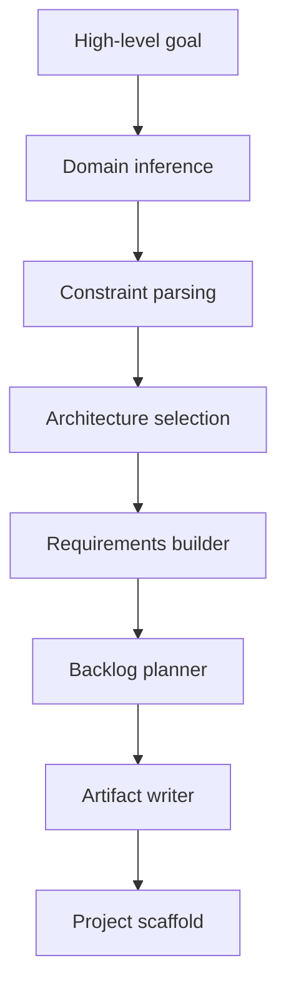

# metaprogramming

[](https://github.com/greenBalding/metaprogramming/actions/workflows/ci.yml)

An experimental project to explore a practical path toward autonomous software construction.

The central idea is simple:

> You provide a high-level goal such as `build a SGA` and the system converts it into a deterministic engineering baseline: specification, architecture decision, phased backlog, governance gates, and starter scaffold.

This repository currently contains a first MVP of that concept.

---

## Table of Contents

- [Project Vision](#project-vision)
- [Current MVP Scope](#current-mvp-scope)
- [Interactive Quick Start](#interactive-quick-start)
- [What Gets Generated](#what-gets-generated)
- [How It Works Internally](#how-it-works-internally)
- [Architecture Selection Rules](#architecture-selection-rules)
- [Quality Gates](#quality-gates)
- [Dry-Run Execution](#dry-run-execution)
- [Repository Layout](#repository-layout)
- [Current Example Output](#current-example-output)
- [Roadmap](#roadmap)
- [Design Principles](#design-principles)
- [FAQ](#faq)
- [Contributing](#contributing)

---

## Project Vision

`metaprogramming` investigates a concrete question:

How do we move from generic AI code generation to a reliable autonomous software factory?

Instead of jumping straight to "full autonomy", the project starts with deterministic, auditable artifacts that engineering teams already understand:

1. Structured requirements
2. Architecture decision record (ADR)
3. Ordered implementation plan
4. Governance and release gates
5. Executable initial scaffold

This makes the output inspectable, testable, and easy to evolve.

---

## Current MVP Scope

The current implementation is a CLI in [autonomous_factory/factory.py](autonomous_factory/factory.py) that:

- Parses a high-level goal
- Infers project domain (academic management or generic web app)
- Offers guided interactive requirement capture with `--interactive`
- Applies deterministic architecture selection rules
- Builds requirements, backlog, and ADR files
- Generates a starter backend, SQL schema, and Bootstrap frontend

It is intentionally lightweight and deterministic by design.

---

## Interactive Quick Start

Use this checklist as an execution path.

- [ ] Step 1: Generate a project

  Run:

  ```bash
  python3 autonomous_factory/factory.py \
    --goal "build a SGA" \
    --interactive \
    --output generated \
    --force
  ```

  If you prefer non-interactive mode, pass explicit constraints with repeated `--constraint key=value`.

- [ ] Step 2: Inspect generated strategy artifacts

  Open:

  - [generated/sga-pilot/spec/requirements.json](generated/sga-pilot/spec/requirements.json)
  - [generated/sga-pilot/architecture/adr-0001-initial-architecture.md](generated/sga-pilot/architecture/adr-0001-initial-architecture.md)
  - [generated/sga-pilot/planning/execution-plan.md](generated/sga-pilot/planning/execution-plan.md)
  - [generated/sga-pilot/governance/release-gates.md](generated/sga-pilot/governance/release-gates.md)

- [ ] Step 3: Run scaffold backend

  ```bash
  cd generated/sga-pilot/scaffold/backend/app
  python3 main.py
  ```

  In another terminal:

  ```bash
  curl http://127.0.0.1:8000/health
  ```

- [ ] Step 4: Review generated frontend placeholder

  Open [generated/sga-pilot/scaffold/frontend/index.html](generated/sga-pilot/scaffold/frontend/index.html).

<details>
<summary>Interactive Prompt Ideas</summary>

Try the same generator with different intents and constraints:

- `--goal "build a SGA" --interactive`
- `--goal "build a SGA for 70000 users" --constraint users=70000`
- `--goal "build an internal helpdesk web app"`
- `--constraint budget=low`
- `--constraint compliance=LGPD,FERPA`

Observe how architecture style and planning output change.

</details>

---

## What Gets Generated

For each run, the generator produces a full baseline package:

1. Requirements spec (`spec/requirements.json`)
2. Architecture decision (`architecture/adr-0001-initial-architecture.md`)
3. Backlog (`planning/backlog.json`)
4. Human-readable execution plan (`planning/execution-plan.md`)
5. Governance gates (`governance/release-gates.md`)
6. Scaffold (`scaffold/backend`, `scaffold/database`, `scaffold/frontend`)

This gives a direct bridge from idea -> implementation kickoff.

---

## How It Works Internally

### High-Level Flow



### Deterministic Pipeline

The MVP is deterministic for the same input set:

- Same goal + constraints -> same style decision
- Same style decision -> same planning skeleton
- Same planning skeleton -> reproducible output structure

This is useful for testing, governance, and CI automation.

---

## Architecture Selection Rules

Current heuristic based on user volume constraints:

| Users | Chosen style |
|---|---|
| `< 10000` | `modular monolith` |
| `10000 - 49999` | `modular monolith + async workers` |
| `>= 50000` | `microservices + event-driven` |

Additional constraints influence:

- `budget=low` -> simpler deployment recommendation
- `cloud=<provider>` -> target cloud recorded in ADR
- `compliance=...` -> compliance list recorded in spec

---

## Quality Gates

This repository now includes CI at [.github/workflows/ci.yml](.github/workflows/ci.yml).

On every push and pull request to `main`, CI runs:

1. Ruff lint on project source
2. Python syntax compilation check
3. Unit tests for generator logic
4. Smoke generation of an SGA project
5. Artifact existence checks for core outputs

Local equivalent commands:

```bash
python3 -m pip install ruff
python3 -m ruff check autonomous_factory
python3 -m compileall autonomous_factory

python3 -m unittest discover -s autonomous_factory/tests -p "test_*.py"

python3 autonomous_factory/factory.py \
  --goal "build a SGA" \
  --project-name local-smoke-sga \
  --constraint users=15000 \
  --constraint cloud=aws \
  --constraint compliance=LGPD \
  --output generated \
  --force
```

---

## Dry-Run Execution

The generator can also produce an execution report without performing real changes.

```bash
python3 autonomous_factory/factory.py \
  --goal "build a SGA" \
  --project-name dry-run-sga \
  --constraint users=15000 \
  --constraint cloud=aws \
  --constraint compliance=LGPD \
  --dry-run-execution \
  --output generated \
  --force
```

This adds:

- `execution/report.json`
- `execution/runbook.md`

### Persistent Execution State

If you want the generator to track progress between runs, add `--advance-phase`.

```bash
python3 autonomous_factory/factory.py \
  --goal "build a SGA" \
  --project-name stateful-sga \
  --dry-run-execution \
  --advance-phase \
  --output generated \
  --force
```

This persists:

- `execution/state.json`
- `execution/state.md`
- `execution/audit-trail.json`

These artifacts summarize phase status and the next safe action.

### Execute Current Phase (Idempotent)

To run the active phase and produce auditable evidence files:

```bash
python3 autonomous_factory/factory.py \
  --goal "build a SGA" \
  --project-name stateful-sga \
  --execute-phase \
  --output generated \
  --force
```

Generated evidence and audit outputs:

- `execution/evidence/`
- `execution/audit-trail.json`

To preview actions without changing files, add `--dry-run-actions` together with `--execute-phase`.

---

## Repository Layout

```text
metaprogramming/
  autonomous_factory/
    factory.py
    README.md
  generated/
    sga-pilot/
      spec/
      architecture/
      planning/
      governance/
      scaffold/
  init/
    metaprogramming.md
    Attachments/
  LICENSE
```

---

## Current Example Output

The repository already contains a generated pilot project:

- [generated/sga-pilot/README.md](generated/sga-pilot/README.md)
- [generated/sga-pilot/spec/requirements.json](generated/sga-pilot/spec/requirements.json)
- [generated/sga-pilot/planning/execution-plan.md](generated/sga-pilot/planning/execution-plan.md)

You can treat it as a baseline reference for future runs and improvements.

---

## Roadmap

Near-term planned evolution:

- Persist interactive interview answers as a decision-log artifact
- Test generation + fix loop (generate -> run -> correct)
- LLM-backed requirement expansion (with deterministic fallback)
- Infra and CI artifact generation templates
- Scoring system for architecture confidence and risk

Mid-term direction:

- Multi-agent orchestration
- Continuous telemetry-driven refinement
- Stronger policy and approval-gate automation

---

## Design Principles

This project follows a few strict principles:

1. Determinism first
2. Explicit artifacts over hidden reasoning
3. Traceable decisions (ADR + plan)
4. Safe defaults for governance
5. Incremental autonomy, not black-box autonomy

---

## FAQ

### Is this a full autonomous software engineer already?

No. It is a deterministic MVP foundation for that direction.

### Why not generate full production code immediately?

Because reliability, alignment, and governance require intermediate artifacts that humans and systems can validate.

### Why focus on SGA examples?

SGA is a rich domain with clear entities, workflows, and governance constraints, making it a good benchmark.

### Is this tied to one stack?

Current scaffold is Python + SQL + Bootstrap placeholder, but the architecture is designed to be extensible.

---

## Contributing

Contributions are welcome.

Suggested first contributions:

1. Add new domain inference packs
2. Add richer constraint parsers
3. Expand scaffold templates
4. Add automated tests for generation invariants
5. Add policy checks for generated artifacts

If you contribute, include:

- Clear problem statement
- Reproducible example input
- Expected output diff
- Backward compatibility notes

---

If you want, the next step is to add CI validation so every push checks generation behavior and test stability automatically.
