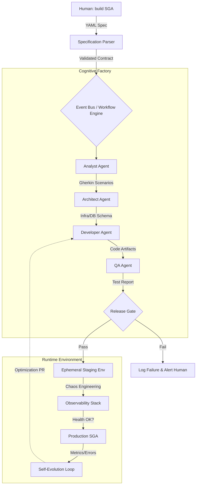

Here is a comprehensive Markdown document that expands upon the previous response, adding deeper technical layers, a conceptual reference architecture, and a practical roadmap.  
  
You can copy the content below and save it as Autonomous_SGA_Construction.md.  
  
```markdown  
# Autonomous Software Construction: A Comprehensive Framework for Self-Building Systems  
**Focus Domain:** *Sistema de Gerenciamento Acadêmico (SGA)*  
  
---  
  
## 1. Introduction: Beyond Code Generation  
  
The command `build an SGA` represents the ultimate aspiration of **Autonomous Software Engineering (ASE)** . This document outlines the essential, non-negotiable conditions required to move beyond Large Language Model (LLM) "vibe coding" toward a deterministic, verifiable, and self-sustaining software factory.  
  
An Autonomous SGA Builder is not merely an AI that writes Python or SQL. It is a **closed-loop, multi-agent system** capable of requirements formalization, architectural synthesis, contract-driven development, continuous verification, and self-healing evolution.  
  
---  
  
## 2. Foundational Conditions: The Six Pillars of Autonomy  
  
For a system to construct an SGA without human intervention in the engineering loop, the following six pillars must be firmly established.  
  
### 2.1. Executable, Non-Ambiguous Specification (The "Blueprint Layer")  
Vague natural language is the enemy of autonomy. The input must be a **machine-parsable contract**.  
  
| Requirement Type | Human Input (Vague) | **Autonomous-Ready Input (Formal)** |  
| :--- | :--- | :--- |  
| **Functional** | "Students can see grades." | `API-GET /grades/{student_id}` with RBAC constraint `role=student` and data mask `PII_sensitive`. |  
| **Architectural** | "Use microservices." | Event-driven topology defined in `docker-compose.agents.yaml` with bounded contexts: `Enrollment`, `Finance`, `Curriculum`. |  
| **Non-Functional** | "It must be fast." | SLA Object: `p95_latency < 200ms`, `availability = 99.9%`. |  
  
**Condition:** The system requires a **Specification-as-Code** engine. It interprets OpenAPI, AsyncAPI, or a Domain-Specific Language (DSL) that defines the SGA's state machines (e.g., `EnrollmentState: PENDING -> APPROVED -> ACTIVE`).  
  
### 2.2. Multi-Agent Collaborative Intelligence (The "Virtual SDLC Team")  
A single monolithic LLM lacks the focus to manage an entire SGA lifecycle. The system must decompose into **Specialized Cognitive Agents** operating in a **Deterministic Workflow**.  
  
| Agent Role | Responsibilities | Key Tools/Modalities |  
| :--- | :--- | :--- |  
| **Analyst Agent** | Translates formal spec into a prioritized backlog of User Stories & Gherkin scenarios. | Semantic search on existing module library; GraphRAG on domain model. |  
| **Architect Agent** | Selects stack, defines data schemas, and draws sequence diagrams. | **Output:** Infrastructure-as-Code (Terraform/Pulumi) + Database Migration Files. |  
| **Developer Agent** | Writes **test-first** code to satisfy Gherkin steps. | **Constraint:** Must compile against strict interface definitions (gRPC/Protobuf). |  
| **QA Agent** | Generates mutation tests, fuzz tests, and edge-case simulations. | **Gate:** Code cannot merge if **Mutation Score < 85%**. |  
| **Deployment Agent** | Manages GitOps pipeline and canary releases. | **Safety:** Requires digital signature verification of previous agent's output. |  
  
**Condition:** A **Message Bus** (e.g., NATS or Kafka) with strict schema enforcement for agent communication. This ensures the *Architect's* output schema matches the *Developer's* input expectation.  
  
### 2.3. Self-Designing Architectural Paradigms (The "Autopoietic" Property)  
The system must be capable of *changing its own structure* to meet new SGA requirements (e.g., adding a new "Library Fine" module).  
  
- **Component-Based Meta-Architecture:** The SGA must be built from a library of **Provenance-Aware Modules**. If a `PaymentGateway` module becomes a bottleneck, the system must be able to hot-swap it with a `CachedPaymentGateway` adapter without manual redeployment.  
- **Emergent Design Constraint:** The system must adhere to **Ports and Adapters (Hexagonal Architecture)** . This allows the Developer Agent to replace the *Database Adapter* without rewriting the *Core Domain Logic*.  
  
### 2.4. Continuous Verification Pipeline (The "Trust but Verify" Loop)  
Without a human to "eyeball" the SGA dashboard, verification must be absolute and automated.  
  
1.  **Contract Testing:** Every API call is validated against the OpenAPI spec *before* code is generated (Design-First).  
2.  **Deterministic Simulation:** The system spins up a **Shadow Environment** (a clone of production SGA with anonymized data) and replays 1,000,000 synthetic student interactions. **Success Condition:** Zero unhandled exceptions and 100% business rule compliance (e.g., no student enrolled in a course without paying fees).  
3.  **Formal Verification (Critical Path):** For `GradeCalculationService` and `TranscriptGeneration`, the system uses **TLA+** or **Lean** to prove that the algorithm is commutative and idempotent.  
  
### 2.5. Self-Evolution Mechanisms (The "Learning Loop")  
An SGA built today will be outdated tomorrow. The system must observe its own performance.  
  
- **Performance Profiling:** Instrumentation detects that `/api/report-card` is slow.  
- **Root Cause Analysis (RCA):** The *Diagnostician Agent* identifies an N+1 query in the ORM.  
- **Autonomous Refactoring:** The *Developer Agent* generates a Pull Request titled `[AUTO] Optimize DB query with eager loading`.  
- **A/B Testing:** The system routes 1% of traffic to the new query path and measures p95 latency improvement. If improved, merge; else, auto-rollback.  
  
### 2.6. Governance, Security, and Safety (The "Do No Harm" Directive)  
Granting autonomy over a system containing student PII (Personally Identifiable Information) requires a **Zero-Trust Execution Environment**.  
  
- **Ephemeral Sandboxes:** All code generation and compilation occurs inside `gVisor` or Firecracker microVMs that have **no network egress** except to the verified artifact repository.  
- **Data Privacy by Design:** The system never sees real student data. It uses **Synthetic Data Generators** that mirror the statistical distribution of real SGA data (e.g., grade curves, course popularity) but contain no actual names or IDs.  
- **Immutable Audit Trail:** Every action taken by every agent is cryptographically signed and logged to an append-only ledger (e.g., Sigstore / Rekor). **Compliance Artifact:** A generated `SGA_SBOM.spdx.json` (Software Bill of Materials) proving no vulnerable libraries were included.  
  
---  
  
## 3. Reference Architecture: The Autonomous SGA Factory  
  

  
---  
  
4. Implementation Roadmap: From Zero to Autonomous SGA  
  
Achieving full autonomy is a phased journey. The following table outlines the maturity model.  
  
Phase Capability Human Role Technology Focus  
Phase 1: Augmented Scaffolding AI generates boilerplate SGA structure (Controllers, Models, Repos) based on a Swagger file. Architect & Senior Dev reviews and connects business logic. OpenAPI Generator, Copilot, Cursor.  
Phase 2: Test-Driven Generation Given a unit test, AI writes the implementation to pass it. QA & Dev writes the test first. Aider, Sweep AI, Codebuff.  
Phase 3: Multi-Agent Assembly Separate agents handle DB schema, API layer, and Frontend. They communicate via contracts. Platform Engineer manages the agent orchestration. AutoGPT, MetaGPT, CrewAI.  
Phase 4: Autonomous Maintenance System detects production bug (e.g., null pointer), reproduces it locally, fixes it, and deploys the patch. SRE monitors and approves auto-merge. SWE-Agent, OpenHands.  
Phase 5: Full Autopoietic Construction System receives build SGA spec and returns a live, secured, scalable URL. Product Owner validates business outcome only. Fully Integrated Framework (This Document's Goal).  
  
---  
  
5. Research Frontiers & Open Challenges  
  
Even with all conditions met, significant hurdles remain in the state of the art:  
  
1. Hallucination of Constraints: LLMs will confidently generate code that looks right but violates a subtle business rule (e.g., "Students can only enroll if they have no financial holds, not just library holds"). Solution: Integration with Constraint Logic Programming rather than pure neural generation.  
2. Temporal Consistency: An SGA is a stateful system. Agents struggle to model the long-term consequences of a database migration on a 10-year-old transcript archive. Solution: Differential Dataflow verification.  
3. UI/UX Empathy: An autonomous system can build a functional SGA dashboard, but it cannot intuit if the interface is frustrating for a 70-year-old professor with poor eyesight. Solution: Human-in-the-loop approval required for visual output.  
  
---  
  
6. Conclusion  
  
Building a system that autonomously constructs an SGA requires a fundamental shift from generating text to orchestrating a deterministic software supply chain. The essential condition is the elimination of ambiguity at every layer—from the input specification to the final deployment.  
  
By implementing a Multi-Agent, Contract-Driven, Verifiable, and Self-Healing architecture, we transition the role of the human from "coder" to "strategist" and "quality auditor." While a fully autonomous build an SGA is a Grand Challenge of Software Engineering, the foundational components described herein are being actively deployed in research labs and forward-thinking engineering organizations today.  
  
```  
```  
