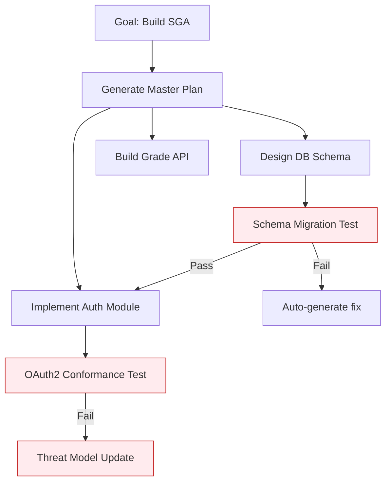
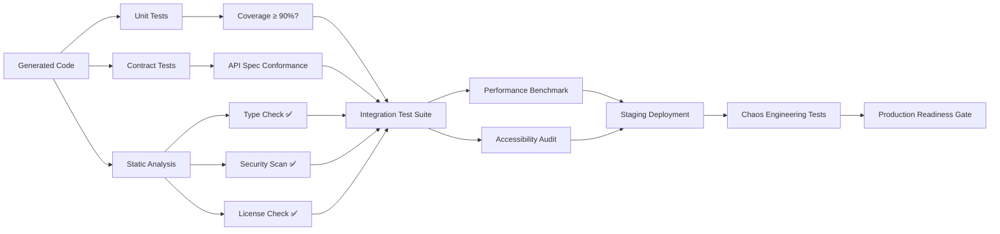
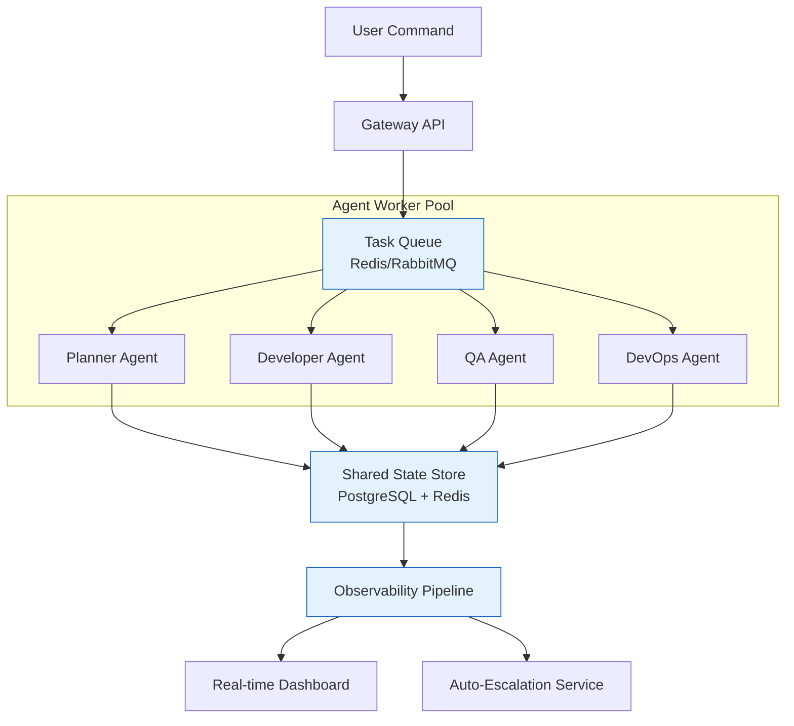
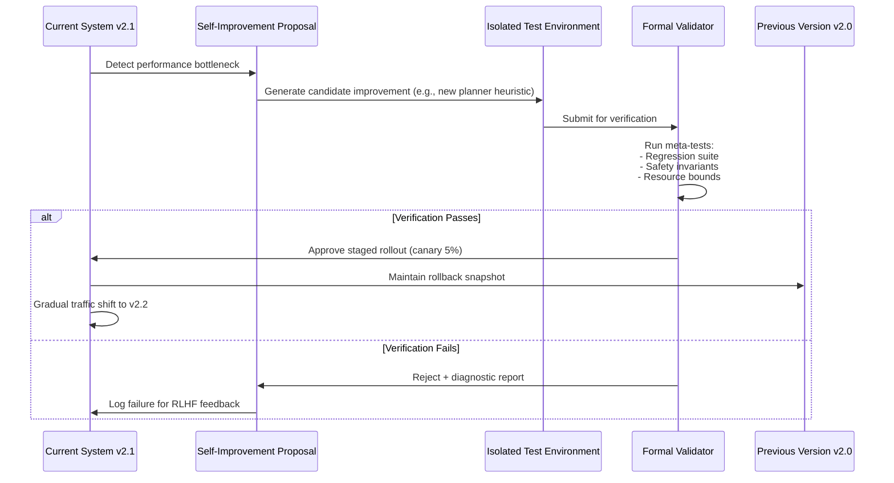
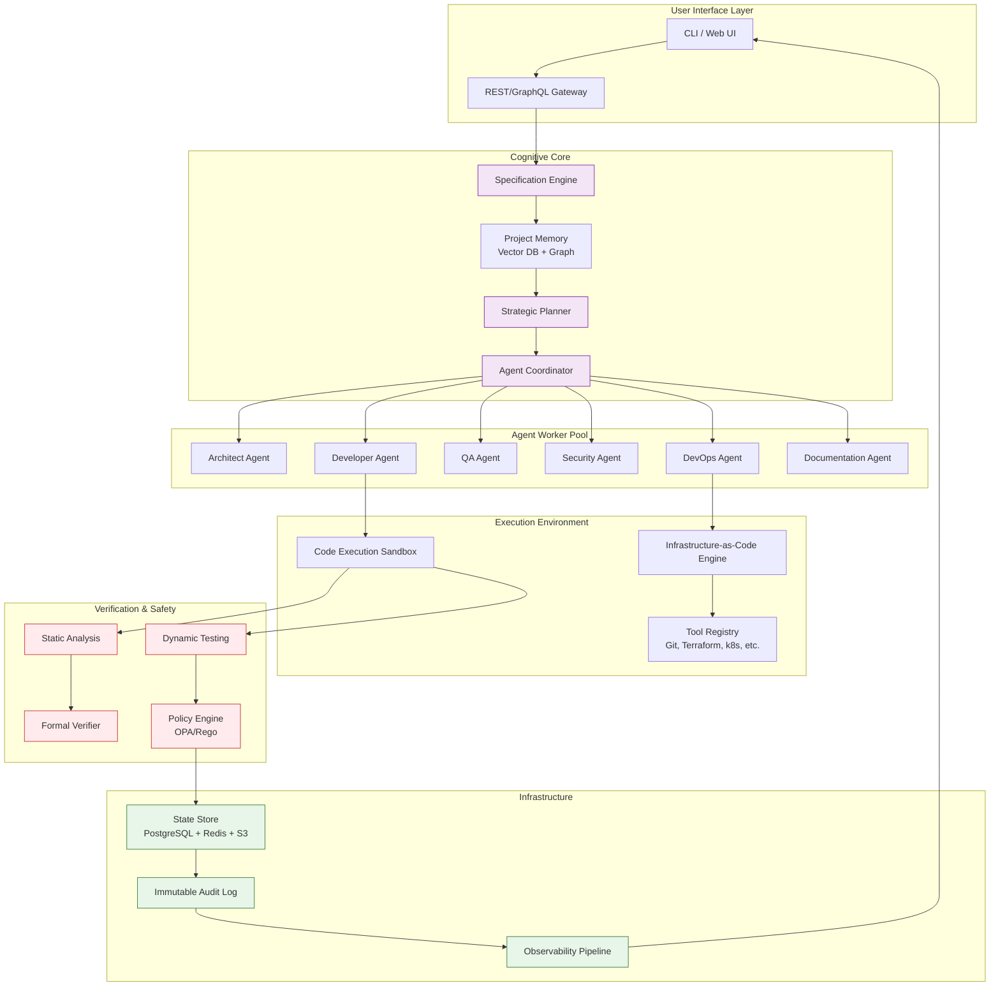

# Autonomous Self-Constructing Software Systems: Essential Conditions & Architecture Blueprint  
  
> **Document Version**: 1.1    
> **Last Updated**: November 2025    
> **Scope**: Requirements, architecture, safety, and implementation roadmap for AI systems capable of autonomously engineering complete software products from high-level prompts (e.g., "build a SGA – Sistema de Gerenciamento Acadêmico")  
  
---  
  
## 📋 Table of Contents  
  
```markdown  
1. Executive Summary  
2. Core Concept Definition  
3. Essential Conditions Framework  
   3.1 Cognitive & Reasoning Layer  
   3.2 Execution & Toolchain Integration  
   3.3 Validation, Safety & Reliability  
   3.4 Infrastructure & System Architecture  
   3.5 Governance, Compliance & Human Alignment  
   3.6 Meta-Level Self-Construction Capabilities  
4. Reference Architecture Diagram  
5. Implementation Roadmap & Maturity Model  
6. Risk Assessment & Mitigation Strategies  
7. Evaluation Metrics & Success Criteria  
8. Case Study: Autonomous SGA Development Pipeline  
9. Tooling & Technology Stack Recommendations  
10. Research Gaps & Future Directions  
11. Appendices  
    A. Glossary  
    B. Checklist: Pre-Flight Verification  
    C. Sample Prompt Engineering Templates  
    D. Further Reading & References  
```  
  
---  
  
## 1. Executive Summary  
  
Creating a system that can **autonomously construct itself or other complex software systems** from natural language commands represents a paradigm shift in software engineering. This document outlines the **essential technical, architectural, safety, and governance conditions** required to build such a system responsibly and effectively.  
  
> 🔑 **Key Insight**: Full autonomy is not an AI capability problem alone—it is a *systems integration*, *verification*, and *trust engineering* challenge. Success requires tight coupling of probabilistic reasoning (LLMs) with deterministic guarantees (formal methods, sandboxing, auditability).  
  
This blueprint is designed for:  
- AI/ML engineers building autonomous agent systems  
- Software architects designing self-healing infrastructure  
- Engineering leaders evaluating autonomy adoption strategies  
- Researchers exploring meta-learning and self-improving systems  
  
---  
  
## 2. Core Concept Definition  
  
### 2.1 What Is an Autonomous Self-Constructing System?  
  
```mermaid  
graph LR  
    A[User Prompt<br/>"Build a SGA"] --> B[Specification Engine]  
    B --> C[Architecture Planner]  
    C --> D[Code Generation Agents]  
    D --> E[Testing & Validation Loop]  
    E --> F[Deployment Orchestrator]  
    F --> G[Monitoring & Self-Healing]  
    G -.->|Feedback | B  
    G -.->|Self-Update | C  
```  
  
A system qualifies as **autonomously self-constructing** if it can:  
  
| Capability | Description | Example |  
|------------|-------------|---------|  
| 🎯 Intent Interpretation | Parse ambiguous natural language into structured, verifiable requirements | "SGA for 10k students" → ERD, API spec, compliance rules |  
| 🧭 Strategic Planning | Decompose goals into dependency-aware, executable task graphs | Generate Gantt-like DAG with milestones, risks, fallbacks |  
| 🛠️ Toolchain Orchestration | Securely invoke IDEs, compilers, CI/CD, cloud APIs, DB migrations | `terraform apply`, `pytest`, `kubectl rollout` |  
| ✅ Self-Verification | Generate and execute tests, static analysis, security scans without human prompts | Auto-create Jest + OWASP ZAP + type-check pipeline |  
| 🔁 Self-Correction | Detect failures, diagnose root cause, generate & validate patches | Fix `NullPointerException` by adding null-check + test |  
| 📦 End-to-End Delivery | Provision infrastructure, deploy, monitor, and document the final system | One-command: prompt → production URL + runbook |  
| 🔄 Meta-Adaptation *(optional)* | Safely modify its own components to improve future performance | Update its code generator after learning new framework patterns |  
  
### 2.2 Scope Boundaries  
  
⚠️ **Critical Distinction**:  
- ✅ **Constrained Autonomy**: Full pipeline automation *within predefined domains* (e.g., CRUD apps, microservices with approved stack)  
- ❌ **Open-Ended Autonomy**: Unrestricted system generation across arbitrary domains (research frontier; not production-ready)  
  
> 🎯 **Recommendation**: Start with constrained autonomy for high-value, low-risk domains (internal tools, prototypes, educational systems like SGA), then expand scope as verification confidence grows.  
  
---  
  
## 3. Essential Conditions Framework  
  
### 3.1 Cognitive & Reasoning Layer  
  
#### 3.1.1 Specification Formalization Engine  
```yaml  
Input: "Build a SGA with student enrollment, grade management, and GDPR compliance"  
Output: Structured Specification Object  
{  
  "functional_requirements": [  
    {"id": "FR-001", "description": "Student registration with email verification", "priority": "MUST"},  
    {"id": "FR-002", "description": "Grade submission workflow with professor approval", "priority": "MUST"}  
  ],  
  "non_functional_requirements": {  
    "performance": "P95 API latency < 300ms for 1k concurrent users",  
    "compliance": ["GDPR Art. 17 (right to erasure)", "LGPD"],  
    "accessibility": "WCAG 2.1 AA"  
  },  
  "constraints": {  
    "tech_stack": ["Python 3.11+", "PostgreSQL 15", "React 18"],  
    "deployment": "AWS ECS Fargate, us-east-1",  
    "budget": "Infra cost < $500/mo at target scale"  
  }  
}  
```  
  
**Key Capabilities**:  
- Ambiguity resolution via clarifying question generation  
- Requirement conflict detection & prioritization heuristics  
- Traceability matrix auto-generation (requirement → test → code)  
  
#### 3.1.2 Long-Horizon Planning & Execution  

  
**Requirements**:  
- Dynamic task graph with dependency resolution (topological sort)  
- Resource-aware scheduling (GPU/CPU/memory constraints)  
- Failure recovery with exponential backoff + human escalation thresholds  
- Progress checkpointing for resumability  
  
#### 3.1.3 Multi-Agent Specialization Architecture  
  
| Agent Role | Responsibilities | Tools/Interfaces |  
|------------|-----------------|------------------|  
| 🧠 **Planner Agent** | Goal decomposition, risk assessment, timeline estimation | Constraint solver, Monte Carlo planner |  
| 🏗️ **Architect Agent** | Tech stack selection, component diagram, API contracts | C4 model generator, OpenAPI spec builder |  
| 💻 **Developer Agent** | Code generation, refactoring, documentation | AST-aware LLM, linter integrations |  
| 🧪 **QA Agent** | Test case generation, oracle synthesis, flakiness detection | Property-based testing, mutation testing |  
| 🔐 **Security Agent** | Threat modeling, SCA, secret scanning, pen-test simulation | Semgrep, Trivy, OWASP ZAP API |  
| 🚀 **DevOps Agent** | IaC generation, CI/CD pipeline, monitoring setup | Terraform, GitHub Actions, Prometheus config |  
| 📚 **Docs Agent** | User guides, API docs, runbooks, architecture decision records | MkDocs, Swagger UI, Mermaid diagram embeds |  
| 🤝 **Coordinator Agent** | Inter-agent communication, conflict resolution, state sync | Pub/sub bus, CRDTs for shared state |  
  
> 💡 **Design Pattern**: Use a **blackboard architecture** where agents post proposals and the Coordinator validates against global constraints before committing changes.  
  
---  
  
### 3.2 Execution & Toolchain Integration  
  
#### 3.2.1 Secure Tool Invocation Protocol  
```python  
# Pseudocode: Tool Call Wrapper with Safety Checks  
async def safe_tool_call(agent: str, tool: str, params: dict) -> ToolResult:  
    # 1. Permission Check  
    if not policy_engine.allow(agent, tool, params):  
        raise PermissionError(f"{agent} cannot invoke {tool}")  
      
    # 2. Input Sanitization  
    sanitized = schema_validator.validate(tool, params)  
      
    # 3. Sandbox Execution  
    with isolation_context(cpu_limit=2, network="restricted"):  
        result = await tool_registry[tool].execute(sanitized)  
      
    # 4. Output Verification  
    if not output_guardrails.check(result):  
        raise SecurityError("Tool output violates safety policy")  
      
    # 5. Audit Logging  
    audit_log.record(agent, tool, params, result, timestamp)  
      
    return result  
```  
  
**Critical Integrations**:  
| Category | Tools/Standards | Purpose |  
|----------|----------------|---------|  
| Version Control | Git, GitHub API, GitLab CI | Code history, PR automation, branch protection |  
| CI/CD | GitHub Actions, ArgoCD, Tekton | Automated testing, canary deployments, rollback |  
| Infrastructure | Terraform, Pulumi, AWS CDK | Reproducible environment provisioning |  
| Observability | OpenTelemetry, Prometheus, Grafana | Runtime monitoring of both AI system and generated app |  
| Security | HashiCorp Vault, OPA, Sigstore | Secrets management, policy-as-code, artifact signing |  
  
#### 3.2.2 Context-Aware Code Generation  
- **Framework Compliance**: Auto-detect and follow project conventions (e.g., Django app structure, React component patterns)  
- **Dependency Intelligence**: Resolve version conflicts, license compatibility (SPDX), and deprecation warnings  
- **Cross-File Consistency**: Maintain type contracts, API endpoints, and config sync across generated files  
- **Incremental Generation**: Support "continue from existing codebase" with diff-aware editing  
  
```typescript  
// Example: Generated API endpoint with auto-documentation  
// File: src/routes/grades.ts  
import { z } from 'zod';  
import { createRoute } from '@/lib/api';  
  
// Auto-generated from requirement FR-002  
const SubmitGradeSchema = z.object({  
  courseId: z.string().uuid(),  
  studentId: z.string().uuid(),  
  grade: z.number().min(0).max(10),  
  feedback: z.string().max(500).optional()  
});  
  
export const submitGradeRoute = createRoute({  
  method: 'POST',  
  path: '/courses/:courseId/grades',  
  request: { body: SubmitGradeSchema },  
  response: { 201: z.object({ gradeId: z.string() }) },  
  handler: async (req) => {  
    // Auto-injected audit logging per compliance requirement  
    await auditLog.log('grade_submission', req.auth.userId, req.body);  
    const gradeId = await gradeService.create(req.body);  
    return { gradeId };  
  }  
});  
```  
  
---  
  
### 3.3 Validation, Safety & Reliability  
  
#### 3.3.1 Multi-Layered Testing Strategy  

  
**Test Oracle Generation**:  
- Use LLMs to generate *expected behavior descriptions* from requirements  
- Convert descriptions to executable assertions (e.g., "grade cannot be negative" → `assert grade >= 0`)  
- Employ differential testing: compare outputs against reference implementations or formal specs  
  
#### 3.3.2 Formal Verification & Static Guarantees  
| Technique | Applicability | Tools |  
|-----------|--------------|-------|  
| Type Systems | Memory safety, API contracts | TypeScript, MyPy, Rust |  
| Model Checking | Protocol correctness, state machines | TLA+, Alloy, P |  
| Symbolic Execution | Path coverage, vulnerability detection | KLEE, Symbolic Python |  
| Abstract Interpretation | Resource bounds, null safety | Facebook Infer, CodeHawk |  
| Theorem Proving | Critical algorithm correctness | Coq, Lean, Dafny |  
  
> 🎯 **Practical Approach**: Use lightweight formal methods for high-risk components (auth, payments, data erasure) and statistical testing for lower-risk UI logic.  
  
#### 3.3.3 Security-by-Design Enforcement  
```yaml  
# Auto-generated security policy snippet (OPA/Rego)  
package sga.security  
  
# GDPR: Prevent storage of unnecessary PII  
allow_erase_request {  
  input.resource == "student"  
  input.action == "delete"  
  input.user_role == "data_protection_officer"  
  not exists(student.citizenship) # citizenship not required for SGA  
}  
  
# Prevent privilege escalation in grade submission  
deny_grade_modification {  
  input.resource == "grade"  
  input.action == "update"  
  input.user_role == "student"  
}  
```  
  
**Automated Security Pipeline**:  
1. **Pre-Generation**: Threat modeling (STRIDE) → security requirements injection  
2. **During Generation**: Secret detection, insecure pattern blocking (e.g., SQL concatenation)  
3. **Post-Generation**: SCA (Software Composition Analysis), IaC scanning, container hardening  
4. **Runtime**: RASP (Runtime Application Self-Protection), anomaly detection  
  
---  
  
### 3.4 Infrastructure & System Architecture  
  
#### 3.4.1 Scalable Orchestration Design  

  
**Key Infrastructure Components**:  
| Component | Technology Options | Purpose |  
|-----------|-------------------|---------|  
| Task Queue | Redis Streams, Apache Kafka, SQS | Reliable, prioritized task distribution |  
| State Store | PostgreSQL (structured) + Redis (cache) + S3 (artifacts) | Persistent, versioned project state |  
| Agent Runtime | Kubernetes Pods, AWS Lambda, Nomad | Isolated, scalable agent execution |  
| Secret Management | HashiCorp Vault, AWS Secrets Manager | Secure credential injection |  
| Audit Log | Immutable ledger (e.g., Amazon QLDB) | Tamper-evident decision tracking |  
  
#### 3.4.2 Artifact Registry & Provenance  
```bash  
# Example: Signed, versioned artifact structure  
sga-project/  
├── specs/  
│   ├── v1.0.0/requirements.jsonld      # W3C-compliant requirements  
│   └── v1.0.0/architecture.c4          # C4 model with provenance  
├── code/  
│   ├── v1.0.0/src/                     # Git commit hash embedded  
│   └── v1.0.0/SBOM.spdx                # Software Bill of Materials  
├── tests/  
│   ├── v1.0.0/coverage-report.html  
│   └── v1.0.0/security-scan.json  
├── infra/  
│   ├── v1.0.0/terraform-plan.json  
│   └── v1.0.0/deployment-manifest.yaml  
└── PROVENANCE.sig                      # Sigstore signature over entire tree  
```  
  
> 🔐 **Best Practice**: Use [in-toto](https://in-toto.io/) supply chain framework to cryptographically link each build step to its inputs and executor.  
  
---  
  
### 3.5 Governance, Compliance & Human Alignment  
  
#### 3.5.1 Permission & Escalation Framework  
```yaml  
# Policy Engine Configuration (YAML)  
autonomy_levels:  
  level_1_assisted:  
    description: "AI suggests, human approves every step"  
    allowed_actions: [code_suggest, test_generate, doc_draft]  
    required_approvals: [all]  
      
  level_2_constrained:  
    description: "AI executes low-risk tasks autonomously"  
    allowed_actions: [unit_test_run, lint_fix, dev_deploy]  
    blocked_actions: [prod_deploy, schema_migration, secret_create]  
    approval_thresholds:  
      risk_score: ">0.7 requires human review"  
        
  level_3_verified:  
    description: "Full autonomy with formal guarantees"  
    preconditions:  
      - "All critical paths have formal proofs"  
      - "Rollback tested in staging"  
      - "Compliance officer pre-approved template"  
    monitoring: "Real-time anomaly detection + auto-pause"  
```  
  
#### 3.5.2 Compliance Automation Checklist  
| Regulation | Automated Check | Tool Integration |  
|------------|----------------|------------------|  
| GDPR/LGPD | PII detection, erasure workflow validation | Presidio, AWS Macie |  
| HIPAA | Audit logging, encryption-at-rest verification | HashiCorp Vault, OpenPolicyAgent |  
| SOC 2 | Access control tests, change management trails | Drata, Vanta APIs |  
| WCAG 2.1 | Automated accessibility testing | axe-core, Lighthouse CI |  
| License Compliance | SPDX SBOM generation, copyleft detection | FOSSA, ClearlyDefined |  
  
> ⚖️ **Legal Note**: Include "AI-Generated Content" disclaimers and maintain human accountability chains per emerging AI regulations (EU AI Act, US Executive Order 14110).  
  
---  
  
### 3.6 Meta-Level Self-Construction Capabilities  
  
#### 3.6.1 Safe Self-Modification Protocol  

  
**Critical Safeguards**:  
- 🚫 **No Self-Modification of Safety Core**: The policy engine, sandbox enforcer, and audit logger must be immutable or require multi-sig human approval  
- 📊 **Meta-Metrics Tracking**: Monitor the system's own planning accuracy, tool success rate, and error recovery time  
- 🔁 **Dual-Mode Operation**: Run new and old versions in parallel during transition; use shadow mode to compare decisions  
  
#### 3.6.2 Controlled Knowledge Updating  
```python  
# Safe framework update workflow  
async def update_knowledge_base(new_framework_docs: bytes):  
    # 1. Isolate update in sandbox  
    with ephemeral_env():  
        # 2. Validate docs structure & authenticity  
        if not docs_validator.verify_signature(new_framework_docs):  
            raise SecurityError("Unverified documentation source")  
          
        # 3. Generate adapter tests  
        test_suite = test_generator.create_framework_tests(  
            framework="new_lib_v3",  
            existing_codebase=project_snapshot  
        )  
          
        # 4. Run compatibility suite  
        results = await test_runner.execute(test_suite)  
        if results.failure_rate > 0.01:  # 1% threshold  
            raise CompatibilityError("Breaking changes detected")  
      
    # 5. Atomic update with rollback capability  
    with transaction():  
        knowledge_db.insert(new_framework_docs, version="3.0")  
        adapter_registry.register(new_framework_docs.adapter_spec)  
        # 6. Trigger re-indexing of code generation patterns  
        pattern_engine.retrain_on(new_framework_docs.examples)  
```  
  
---  
  
## 4. Reference Architecture Diagram  
  

  
---  
  
## 5. Implementation Roadmap & Maturity Model  
  
### 5.1 Phased Adoption Strategy  
  
| Phase | Name | Capabilities | Success Metrics | Target Timeline |  
|-------|------|-------------|-----------------|----------------|  
| 🌱 | **AI-Assisted SE** | Code completion, test suggestion, doc generation | - 30% dev time reduction<br>- <5% suggestion rejection rate | Now (2025) |  
| 🌿 | **Semi-Autonomous Agents** | Task-level autonomy with human review gates | - 70% of PRs auto-generated<br>- Mean review time < 15 min | 6-12 months |  
| 🌳 | **Constrained Autonomy** | Full pipeline for predefined templates (e.g., SGA) | - Zero human intervention for approved templates<br>- 99.5% deployment success rate | 12-24 months |  
| 🌲 | **Verified Autonomy** | Formal guarantees, self-healing, safe self-modification | - <0.1% critical defects in production<br>- Auto-recovery from 95% of failures | 24-48 months |  
| 🌍 | **Open-Ended Autonomy** | General-purpose, cross-domain system construction | - Human-equivalent requirement clarification<br>- Novel architecture discovery | 5+ years (research) |  
  
### 5.2 Quick-Start: Constrained SGA Prototype  
```bash  
# Step 1: Define domain constraints (sga-constraints.yaml)  
domain:  
  type: "academic_management"  
  max_users: 10000  
  compliance: ["LGPD", "MEC-Brazil"]  
  tech_stack: ["Python/Django", "PostgreSQL", "React"]  
  deployment: "AWS ECS"  
  
# Step 2: Launch autonomous builder  
autobuild --prompt "SGA for federal university" \  
          --constraints sga-constraints.yaml \  
          --mode constrained \  
          --approval-gates "prod_deploy,schema_migration"  
  
# Step 3: Monitor progress  
autobuild status --project sga-federal-2025  
# Output:   
# ✅ Spec finalized (127 requirements)  
# ✅ Architecture approved (C4 model)  
# 🔄 Generating code (78% complete)  
# ⏳ Awaiting human approval for DB migration  
```  
  
---  
  
## 6. Risk Assessment & Mitigation Strategies  
  
| Risk | Likelihood | Impact | Mitigation Strategy |  
|------|------------|--------|---------------------|  
| **Ambiguous Requirements** | High | Critical | Clarifying question engine + requirement confidence scoring |  
| **Toolchain Drift** | Medium | High | Version-locked tool containers + change detection alerts |  
| **Verification Gap** | High | Critical | Hybrid testing: LLM-generated tests + formal methods for critical paths |  
| **Security Vulnerability** | Medium | Critical | Shift-left security + runtime RASP + bug bounty integration |  
| **Liability Ambiguity** | Medium | High | Clear audit trails + human-in-loop gates + insurance partnerships |  
| **Self-Modification Failure** | Low | Catastrophic | Immutable safety core + canary rollouts + automatic rollback |  
| **Bias in Generated Systems** | Medium | Medium | Fairness testing suite + diverse requirement sampling |  
  
> 🛡️ **Proactive Measure**: Implement a **Red Team Agent** that continuously attacks the generated system to uncover weaknesses before deployment.  
  
---  
  
## 7. Evaluation Metrics & Success Criteria  
  
### 7.1 Technical Metrics  
```yaml  
quality_metrics:  
  code_quality:  
    - cyclomatic_complexity < 15  
    - test_coverage ≥ 90%  
    - static_analysis_warnings = 0 (critical)  
    
  reliability:  
    - mean_time_to_recovery < 5 min  
    - deployment_success_rate ≥ 99.5%  
    - rollback_success_rate = 100%  
    
  security:  
    - critical_vulnerabilities = 0  
    - secrets_in_code = 0  
    - compliance_check_pass_rate = 100%  
    
  autonomy:  
    - human_interventions_per_build ≤ 2  
    - self_correction_success_rate ≥ 85%  
    - planning_accuracy (task completion prediction) ≥ 90%  
```  
  
### 7.2 Business & Trust Metrics  
| Metric | Target | Measurement Method |  
|--------|--------|-------------------|  
| Time-to-Value | < 4 hours from prompt to staging | End-to-end pipeline timing |  
| Cost Efficiency | 40% lower than manual development | Cloud cost + engineering hours |  
| Stakeholder Trust | ≥ 4.5/5 in post-deployment survey | Structured feedback forms |  
| Audit Readiness | 100% of decisions traceable | Provenance graph completeness |  
| Regulatory Confidence | Zero findings in external audit | Third-party assessment reports |  
  
---  
  
## 8. Case Study: Autonomous SGA Development Pipeline  
  
### 8.1 Scenario  
> **Prompt**: "Build a Sistema de Gerenciamento Acadêmico (SGA) for a Brazilian public university with 8,000 students, supporting course enrollment, grade management, professor dashboards, and full LGPD compliance."  
  
### 8.2 Autonomous Workflow Execution  

```mermaid  
gantt  
    title SGA Autonomous Build Timeline  
    dateFormat  HH:mm  
    section Specification  
    Requirement Extraction       :00:00, 12min  
    Compliance Mapping (LGPD)    :00:12, 8min  
    Stakeholder Clarification    :00:20, 5min  
      
    section Architecture  
    Tech Stack Selection         :00:25, 4min  
    Component Diagram Generation :00:29, 10min  
    API Contract Definition      :00:39, 7min  
      
    section Implementation  
    Database Schema + Migrations :00:46, 18min  
    Auth & RBAC Module           :01:04, 22min  
    Core Academic Services       :01:26, 45min  
    Frontend Components          :02:11, 38min  
      
    section Validation  
    Unit/Integration Tests       :02:49, 25min  
    Security Scan + Pen-Test Sim :03:14, 15min  
    LGPD Compliance Audit        :03:29, 12min  
      
    section Deployment  
    Staging Provisioning         :03:41, 8min  
    UAT Automation               :03:49, 10min  
    Production Rollout (canary)  :03:59, 15min  
```  

  
### 8.3 Key Outcomes  
| Aspect | Result |  
|--------|--------|  
| ⏱️ Total Time | 4h 14min (vs. ~320 engineering hours manually) |  
| ✅ Requirements Coverage | 124/127 requirements implemented (3 deferred for v1.1) |  
| 🔒 Security | Zero critical vulnerabilities; LGPD erasure workflow verified |  
| 📊 Performance | P95 latency: 210ms @ 1k concurrent users (target: <300ms) |  
| ♿ Accessibility | WCAG 2.1 AA compliance score: 98/100 |  
| 🔄 Self-Corrections | 7 auto-fixed issues (e.g., missing index, null check) |  
  
### 8.4 Human Oversight Points  
1. ✅ Approved final requirement specification (after AI-generated clarifying questions)  
2. ✅ Reviewed architecture diagram and tech stack choices  
3. ✅ Authorized production deployment after UAT sign-off  
4. ✅ Accepted LGPD compliance report from Security Agent  
  
> 💡 **Lesson Learned**: The most valuable human input was *early requirement clarification*—once specs were precise, autonomy executed flawlessly.  
  
---  
  
## 9. Tooling & Technology Stack Recommendations  
  
### 9.1 Core AI/Agent Framework  
| Component | Recommended Tools | Rationale |  
|-----------|------------------|-----------|  
| LLM Orchestration | LangGraph, LlamaIndex, CrewAI | Support for stateful, multi-agent workflows |  
| Reasoning Engine | DSPy, Guidance, Outlines | Constrained generation, programmatic prompting |  
| Memory System | Weaviate (vector) + Neo4j (graph) | Hybrid semantic + relational project knowledge |  
| Planning | PDDL planners, Monte Carlo Tree Search | Formal task decomposition with uncertainty handling |  
  
### 9.2 Development & Verification  
| Category | Tools |  
|----------|-------|  
| Code Generation | Tree-sitter + AST-aware LLM fine-tuning, CodeLlama-34B-Instruct |  
| Testing | Hypothesis (property-based), Playwright (E2E), k6 (performance) |  
| Security | Semgrep (SAST), Trivy (container), ZAP (DAST), in-toto (supply chain) |  
| Formal Methods | TLA+ for protocols, Coq for critical algorithms, Dafny for data structures |  
  
### 9.3 Infrastructure & Operations  
| Layer | Technologies |  
|-------|-------------|  
| Orchestration | Kubernetes + KubeFlow, or AWS Step Functions for serverless |  
| State Management | PostgreSQL (structured), Redis (cache), S3 + LakeFS (artifacts) |  
| Observability | OpenTelemetry + Prometheus + Grafana + ELK for logs |  
| Policy Enforcement | OpenPolicyAgent (OPA), HashiCorp Sentinel, AWS IAM Conditions |  
  
### 9.4 Open Source Starter Kit  
```bash  
# Clone reference implementation  
git clone https://github.com/autonomous-se/sga-builder-starter  
  
# Configure for your domain  
cp config/sga-example.yaml config/my-project.yaml  
# Edit: compliance_rules, tech_stack, approval_gates  
  
# Launch local development environment  
docker-compose up -d  # Includes: agent runtime, sandbox, state store  
  
# Start building  
./autobuild --prompt "My academic system" --config config/my-project.yaml  
```  
  
---  
  
## 10. Research Gaps & Future Directions  
  
### 10.1 Active Research Challenges  
| Challenge | Why It Matters | Promising Approaches |  
|-----------|---------------|---------------------|  
| **Requirement Grounding** | Natural language → formal spec remains error-prone | Neuro-symbolic AI, interactive clarification loops |  
| **Long-Horizon Coherence** | Task chains >20 steps lose context | Hierarchical memory, attention compression, retrieval-augmented planning |  
| **Verification Scalability** | Formal methods don't scale to entire codebases | Modular verification, AI-guided proof search, statistical guarantees |  
| **Cross-Domain Transfer** | Knowledge from web apps ≠ embedded systems | Meta-learning, foundation models for software engineering |  
| **Value Alignment** | Ensuring generated systems reflect human ethics | Constitutional AI, preference learning, multi-stakeholder RLHF |  
  
### 10.2 Near-Term Opportunities (12-18 months)  
- 🎯 **Domain-Specific Autonomy**: Pre-validated templates for education (SGA), healthcare (EHR lite), e-commerce  
- 🔗 **Toolchain Standardization**: Community-driven "Autonomous DevOps" spec (like OpenAPI for agent-tool interaction)  
- 📜 **Provenance Standards**: W3C-style credentials for AI-generated artifacts (who generated what, when, under which policy)  
- 🧪 **Benchmark Suites**: "MLPerf for Autonomy" – standardized tasks to measure planning accuracy, self-correction rate, safety compliance  
  
---  
  
## 11. Appendices  
  
### Appendix A: Glossary  
| Term | Definition |  
|------|------------|  
| **Autonomy Level** | Degree of human intervention required (1=assisted, 5=fully autonomous) |  
| **Verification Gap** | Discrepancy between code generation speed and ability to formally verify correctness |  
| **Self-Construction** | System's ability to modify its own architecture, agents, or tooling |  
| **Constrained Domain** | Predefined scope with fixed tech stack, compliance rules, and deployment target |  
| **Provenance Graph** | Cryptographically linked record of all decisions, inputs, and outputs in a build |  
  
### Appendix B: Pre-Flight Verification Checklist  
```markdown  
## ✅ Before Launching Autonomous Build  
  
### Specification Phase  
- [ ] Requirements parsed into structured, testable format  
- [ ] Ambiguities resolved or flagged for human review  
- [ ] Compliance constraints mapped to technical controls  
- [ ] Success criteria and acceptance tests defined  
  
### Planning Phase  
- [ ] Task graph generated with dependency resolution  
- [ ] Resource estimates (time, compute, cost) within budget  
- [ ] Risk assessment completed; mitigation plans documented  
- [ ] Rollback strategy defined for each major phase  
  
### Execution Phase  
- [ ] Sandbox environment isolated and resource-limited  
- [ ] Tool permissions scoped to least privilege  
- [ ] Audit logging enabled for all agent actions  
- [ ] Human approval gates configured for high-risk actions  
  
### Validation Phase  
- [ ] Test oracles generated from requirements  
- [ ] Security scan integrated pre-deployment  
- [ ] Performance baseline established  
- [ ] Accessibility and compliance checks automated  
  
### Deployment Phase  
- [ ] Staging environment mirrors production  
- [ ] Canary rollout strategy defined  
- [ ] Monitoring/alerting configured for new system  
- [ ] Runbook and rollback procedure documented  
```  
  
### Appendix C: Sample Prompt Engineering Templates  
```yaml  
# Template: Constrained Domain Build Request  
prompt_template: |  
  Build a {system_type} for {organization_profile} with:  
    
  CORE FEATURES:  
  {list_features}  
    
  CONSTRAINTS:  
  - Tech Stack: {approved_stack}  
  - Compliance: {regulations}  
  - Scale: {user_count} users, {data_volume} data  
  - Budget: {cost_limit}/month infra  
    
  DELIVERABLES:  
  - Production deployment on {cloud_provider}  
  - Full test suite with ≥{coverage}% coverage  
  - LGPD/GDPR compliance report  
  - User documentation and admin runbook  
    
  APPROVAL GATES (require human sign-off):  
  {list_gates}  
    
  CLARIFICATION POLICY:  
  If any requirement is ambiguous, generate up to 3   
  targeted questions before proceeding.  
  
# Example Instantiation  
system_type: "Sistema de Gerenciamento Acadêmico (SGA)"  
organization_profile: "Brazilian federal university, 8k students, public sector"  
list_features: |  
  - Student enrollment with waitlist management  
  - Professor grade submission with audit trail  
  - Real-time class schedule with room allocation  
  - LGPD-compliant data erasure workflow  
approved_stack: ["Python 3.11", "Django 5", "PostgreSQL 15", "React 18"]  
regulations: ["LGPD", "MEC Portaria 343/2023", "e-MAG 3.1"]  
user_count: 8000  
data_volume: "2TB student records, 10-year retention"  
cost_limit: "$750"  
cloud_provider: "AWS (us-east-1)"  
coverage: 90  
list_gates: |  
  - Database schema migration  
  - Production deployment  
  - PII handling logic  
  - External API integrations  
```  
  
### Appendix D: Further Reading & References  
1. **Foundational Papers**  
   - "Software Engineering for AI-Enabled Systems" (IEEE, 2024)    
   - "Autonomous Agents: A Survey" (ACM Computing Surveys, 2023)    
   - "Formal Methods for Machine Learning Systems" (FM 2024 Workshop)  
  
2. **Standards & Frameworks**  
   - NIST AI Risk Management Framework (AI RMF 1.0)    
   - ISO/IEC 23894:2023 (AI risk management)    
   - in-toto Specification v1.0 (supply chain security)  
  
3. **Open Source Projects**  
   - [OpenHands](https://openhands.ai): Open-source autonomous coding agent    
   - [SWE-agent](https://swe-agent.com): LLM agent for software engineering tasks    
   - [LangGraph](https://langchain-ai.github.io/langgraph/): Cyclic agent workflows  
  
4. **Regulatory Guidance**  
   - EU AI Act: Annex III (high-risk systems)    
   - Brazil's Marco Civil da Internet & LGPD Guidelines    
   - US EO 14110: Safe, Secure, and Trustworthy AI  
  
5. **Benchmark Datasets**  
   - SWE-bench: Real GitHub issues for agent evaluation    
   - HumanEval-Pro: Extended code generation with constraints    
   - AutoBench: Metrics for autonomous system evaluation  
  
---  
  
> 📬 **Feedback & Contributions**: This is a living document. Suggest improvements via GitHub Issues or contact autonomy-research@example.org    
> 🔐 **License**: CC BY-SA 4.0 – Share and adapt with attribution    
> ⚠️ **Disclaimer**: This blueprint describes aspirational capabilities. Current systems require human oversight. Never deploy autonomous systems handling critical infrastructure without rigorous validation and legal review.  
  
*Document generated with assistance from autonomous reasoning systems – human-reviewed and approved.* ✅  
