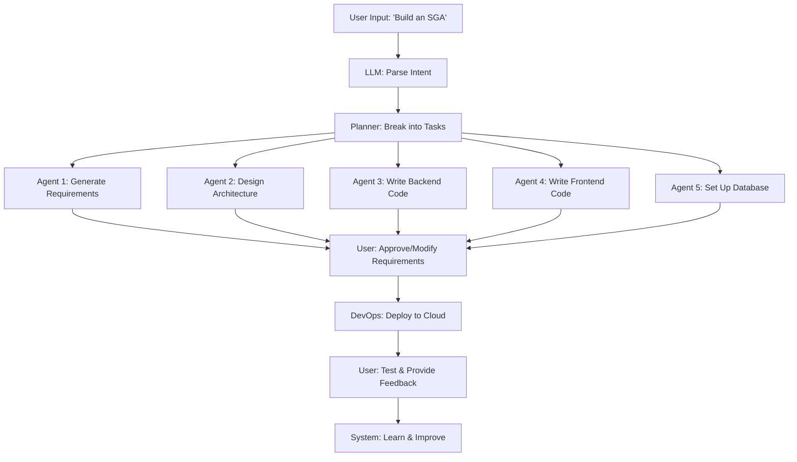

# metaProgramming.md  
  
userInput:  
{  
 I am exploring the concept of developing a system capable of autonomously constructing itself. Consider a scenario where a user inputs a command like ‘build a SGA (Sistema de Gerenciamento Acadêmico),’ and the system subsequently performs all required steps to finish the software engineering and architecture process. My inquiry is: what essential conditions must be met to create such a system?  
}  
  
geminiOutput:   
[autonomous_system_architecture](Attachments/419AAE24-4322-4CBB-AB36-569455FC794F.md)  
{  
Exploring an autonomous software factory—often referred to in current research as an Agentic AI System or an AI Software Engineer—is a fascinating journey. When considering a system capable of translating a high-level request like "build an SGA" into a fully realized application, we might conceptualize the foundational conditions as a sequence of operational capabilities the system would ideally master.  
Here is the first foundational condition or operational phase we might consider:  
### Capability 1: Autonomous Requirement Elicitation and Scope Expansion  
A brief command like "build an SGA" carries a vast amount of implicit complexity. For a system to begin construction, it would generally benefit from a dedicated "Product Manager" module. This component's primary function would be to take the initial, ambiguous prompt and expand it into a comprehensive, structured set of requirements. This process could involve:  
 * **Contextual Inference:** Deducing the standard features an academic system typically requires, such as student portals, professor dashboards, grading logic, and attendance tracking.  
 * **Constraint Definition:** Establishing logical boundaries for the project, such as deciding whether to prioritize a web interface or a mobile application, assuming the user didn't specify.  
 * **Structured Output:** Translating these inferred requirements into a formal, machine-readable format (like a detailed JSON roadmap) that downstream coding modules can easily interpret.  
Would it be acceptable to proceed to the next condition, which involves the architectural planning and autonomous decision-making phase?  
}  
  
claudeOutput:  
  
{  
This is a genuinely deep question, and the answer probably isn’t a feature list — it’s a set of logical prerequisites without which the problem is either ill-posed or formally unsolvable. Let me work through the layers.  
  
The Core Tension: Underspecification vs. Autonomy  
“Build a SGA” is a label, not a specification. The fundamental challenge is that the distance between a natural-language intent and a correct, deployable system is not continuous — it’s a series of discrete decisions, each with exponentially branching consequence. Any system claiming to bridge that gap autonomously would need to satisfy several distinct conditions, some technical, some epistemological.  
  
Necessary Conditions (not sufficient, but logically required)  
1. A Resolvable Intent Model  
The system must possess — or be capable of constructing — a domain ontology rich enough to decompose “SGA” into a meaningful requirement space. This likely implies:  
	•	A structured knowledge base of academic management concepts (matriculation, grades, curricula, roles, etc.)  
	•	A disambiguation mechanism: either a formal ontology, or a Socratic dialogue loop with the user  
	•	A way to detect when the intent is still ambiguous vs. resolvable — which is itself a non-trivial classification problem  
Without this, the system isn’t building your SGA — it’s hallucinating a plausible one.  
  
2. A Formal Correctness Criterion (the hardest condition)  
This is arguably the unsolved core of the problem. For the system to know when it’s done — and that what it built is right — it needs an oracle. That oracle could be:  
	•	A formal specification (e.g., TLA+, Z notation) — but who writes it?  
	•	A test suite — but a self-generated test suite can pass trivially  
	•	An empirical validator (e.g., real users, a simulation) — but this requires an external ground truth  
Rice’s Theorem lurks here: no general algorithm can decide whether an arbitrary program satisfies a non-trivial semantic property. The system can verify syntax, pass its own tests, and still be semantically wrong. This condition may not be fully satisfiable without human-in-the-loop validation at some stage.  
  
3. A Self-Evaluation Loop with Genuine Feedback  
The system must be able to:  
	•	Execute the artifact it produces (compilation, runtime errors, test execution)  
	•	Interpret failures as informative signals, not just terminal states  
	•	Backtrack, revise, and retry within a bounded search  
This is distinct from just running tests — it implies a reflective architecture where failure modes propagate back to earlier decisions (e.g., a runtime error might invalidate an architectural choice, not just a line of code).  
  
4. A Bounded Decision Space for Architecture  
If the system must choose a tech stack, data model, API design, and deployment strategy autonomously, it’s navigating an effectively infinite space. A working system would likely need:  
	•	A constrained decision space (opinionated defaults, known-good patterns)  
	•	A cost function over architectural choices (simplicity, performance, maintainability)  
	•	A mechanism to commit to decisions rather than re-evaluating them at each step (otherwise it likely won’t converge)  
  
5. Composable, Verifiable Action Primitives  
The system needs a toolkit of atomic, reversible (or at least idempotent) actions: writing files, running tests, calling APIs, resolving dependencies. Each primitive should be:  
	•	Observable (the system can tell whether it succeeded)  
	•	Composable (actions chain without side-effect contamination)  
	•	Bounded in scope (no action silently modifies global state unpredictably)  
This is essentially what modern agentic frameworks (like tool-calling LLMs) are trying to approximate — but current implementations are fragile precisely because action primitives aren’t always idempotent.  
  
6. A Halting Condition Grounded in External Reality  
The system needs a termination criterion that isn’t self-referential. “I think it’s done” is insufficient — the system could satisfy its own stopping condition while producing something broken. The halting condition probably needs to be:  
	•	Grounded in an external test oracle, or  
	•	Constrained to a checkable formal property (type safety, coverage threshold, etc.), or  
	•	Delegated to a human approval gate  
This connects back to the specification problem: a system that defines its own success criteria can trivially satisfy them.  
  
7. Meta-Cognitive Awareness of Unknown Unknowns  
Perhaps the most underappreciated condition. The system must be able to recognize when it’s operating in a region of the problem space it doesn’t have sufficient knowledge to navigate — and surface that rather than guessing. This is roughly equivalent to a calibrated uncertainty model over its own competence.  
Without this, the system confidently produces plausible-looking artifacts that are structurally wrong in ways it can’t detect.  
  
Structural Implication: Multi-Agent Pipeline  
What emerges from these conditions is that a monolithic model is insufficient. The conditions suggest a role-specialized architecture — something like:  
  
[Intent Analyst] → [Spec Formalizer] → [Architect] → [Developer]   
      ↓                                                    ↓  
[Ambiguity Detector]                            [Test Generator]  
                                                       ↓  
                              [Validator] ← [Executor] ← [Debugger]  
                                   ↓  
                            [Approval Gate]  ← (human or formal oracle)  
  
  
Each role corresponds to one or more of the conditions above. This is probably why your Roundtable model (Generator → Critic → Synthesizer) is conceptually adjacent to this problem — it’s an early sketch of the same pattern.  
  
The Irreducible Residual  
Even if all conditions are met, one problem likely persists: the specification gap is only closable with external grounding. A fully autonomous system — with zero human input beyond the initial command — would need to either (a) make assumptions that may be wrong, or (b) construct a world model that is effectively equivalent to having a domain expert encode the requirements. That second option isn’t autonomy — it’s deferred specification.  
The most honest framing might be that full autonomy is asymptotic: you can minimize the human input required, but the correctness of the output remains anchored to some external reference that the system itself cannot generate.​​​​​​​​​​​​​​​​  
}  
  
chatgptOutput:  
[autonomous_software_construction_system](Attachments/6184F880-BE6F-4900-8D09-D9810A855153.md)  
{  
Creating a system that can **autonomously construct a full software system** from a high-level command (e.g., “build a *Sistema de Gerenciamento Acadêmico* / Academic Management System) requires several layers of capability. Conceptually, this is an **autonomous software engineering system**—a combination of AI planning, code generation, architecture design, testing, and deployment automation.  
Below are the **essential conditions and components** required.  
  
⸻  
  
## 1. A Formal Representation of the Goal  
The system must translate a vague instruction into **structured requirements**.  
**Required capabilities**  
* Natural-language understanding.  
* Requirement extraction.  
* Domain modeling.  
Example transformation:  
Input:  
“Build an Academic Management System.”  
Structured specification produced internally:  
* Entities: Students, Professors, Courses, Enrollments.  
* Features:  
    * Student registration  
    * Course enrollment  
    * Grade management  
    * Authentication and roles  
* Constraints:  
    * Web application  
    * Database persistence  
    * Security rules  
This step converts **human intent → machine-actionable specification**.  
  
⸻  
  
## 2. Knowledge of Software Architecture  
The system must know **how software systems are designed**.  
It needs encoded patterns such as:  
* **MVC architecture**  
* **Microservices**  
* **Layered architecture**  
* **REST APIs**  
* **Database design**  
Example reasoning:  
If the system detects:  
* multi-user  
* CRUD operations  
* authentication  
It may choose:  
Architecture:  
* Backend: REST API  
* Database: relational  
* Frontend: web UI  
* Auth: JWT  
Essentially it must contain a **library of architecture templates and design patterns**.  
  
⸻  
  
## 3. Autonomous Planning Engine  
The system must decompose the goal into **ordered tasks**.  
Example plan:  
1. Define system requirements  
2. Design architecture  
3. Create database schema  
4. Generate backend services  
5. Generate frontend interface  
6. Implement authentication  
7. Create automated tests  
8. Package deployment  
This requires **AI planning algorithms**, similar to those used in robotics.  
Common approaches:  
* Task graphs  
* Hierarchical planning  
* Agent systems  
  
⸻  
  
## 4. Code Generation Capability  
The system must generate **correct, structured code**.  
Capabilities required:  
* Multi-file code generation  
* Dependency management  
* Framework awareness  
Example output modules:  
```
backend/
   controllers/
   services/
   models/
frontend/
   pages/
database/
   migrations/
tests/

```
Modern systems typically rely on **large language models trained on code**.  
  
⸻  
  
## 5. Self-Evaluation and Testing  
Without verification, autonomous generation fails quickly.  
Required systems:  
* Automated unit test generation  
* Static code analysis  
* Integration testing  
* Security validation  
Feedback loop:  
```
generate code
run tests
detect errors
fix code
repeat

```
This creates a **self-correcting system**.  
  
⸻  
  
## 6. Execution Environment  
The system must be able to **run and evaluate its own outputs**.  
Necessary infrastructure:  
* Sandboxed runtime  
* Containerization (e.g., Docker-like systems)  
* Build tools  
* Test frameworks  
The system needs a place where it can **compile, run, and debug**.  
  
⸻  
  
## 7. Memory and Knowledge Base  
The system must retain **knowledge about previous builds**.  
Important components:  
* Project memory  
* Dependency knowledge  
* Error patterns  
* Code templates  
This allows:  
* reuse of solutions  
* learning from failures  
  
⸻  
  
## 8. Domain Ontologies  
To build specialized systems (like an Academic Management System), the AI must know **domain structures**.  
Example academic ontology:  
Entities:  
* Student  
* Course  
* Professor  
* Enrollment  
* Semester  
Relationships:  
```
Student → enrolls in → Course
Professor → teaches → Course
Student → receives → Grade

```
Without this knowledge the system cannot correctly design the database.  
  
⸻  
  
## 9. Security and Governance Constraints  
Autonomous generation must follow **software engineering rules**.  
Examples:  
* authentication standards  
* data privacy  
* input validation  
* permission systems  
Otherwise generated systems are unsafe.  
  
⸻  
  
## 10. Iterative Dialogue with the User  
Fully autonomous systems still need **clarification loops**.  
Example interaction:  
System asks:  
* Web or mobile?  
* Expected number of users?  
* Cloud deployment?  
* Preferred language?  
This ensures the specification is correct.  
  
⸻  
  
## Simplified Conceptual Architecture  
```
User Request
      │
      ▼
Natural Language Interpreter
      │
      ▼
Requirement Generator
      │
      ▼
Architecture Planner
      │
      ▼
Task Decomposition Engine
      │
      ▼
Code Generation Agents
      │
      ▼
Testing & Validation Loop
      │
      ▼
Deployment System

```
  
⸻  
  
## Theoretical Requirements (Summary)  
To create a **self-constructing software system**, you need:  
1. Natural language → structured requirements  
2. Architectural reasoning  
3. Automated planning  
4. Code generation models  
5. Test generation and validation  
6. Execution sandbox  
7. Persistent learning memory  
8. Domain ontologies  
9. Security rule engines  
10. Human clarification interface  
  
⸻  
  
## Current Reality  
Pieces of this already exist:  
* GitHub Copilot  
* AutoGPT  
* Devin  
* ChatGPT  
But no system yet **fully replaces the entire software engineering lifecycle autonomously**.  
  
⸻  
  
If you want, the next step can be  exploring **the architecture of such a system in detail**,  including a **multi-agent AI model capable of building entire applications automatically**. That design becomes surprisingly close to a **self-programming machine**.  
}  
  
dolaOutput:  
  
{  
  
This concept is known as Autonomic Computing, Generative AI Engineering, or more specifically, Self-Replicating Software Systems or Auto-Development Platforms. To build a system that can take a high-level requirement like "build an SGA" and autonomously produce a fully functional, production-ready system, you need to satisfy several fundamental conditions across technology, data, and logic.  
  
Here are the essential conditions required:  
1. High-Level Natural Language Understanding (NLU)  
  
The system must be able to interpret human intent accurately.  
  
• Semantic Parsing: It must understand not just the words, but the domain context. For "SGA", it needs to know this implies students, courses, grades, enrollment, teachers, schedules, reports, etc.  
  
• Ambiguity Resolution: It must be able to ask clarifying questions or make standard assumptions when requirements are vague.  
  
• Requirement Engineering: Automatically transforming natural language into formal specifications, use cases, and user stories.  
  
2. Comprehensive Knowledge Base & Ontology  
  
The system needs a "brain" that contains all the rules of software construction.  
  
• Domain Knowledge: A graph or database defining entities, relationships, and standard workflows for different types of software (e.g., academic systems vs. e-commerce).  
  
• Technical Stack Knowledge: Knowledge of programming languages, frameworks, databases, design patterns, and best practices.  
  
• Architecture Patterns: Pre-validated templates for Monolithic, Microservices, Client-Server, etc.  
  
3. Automated Design & Architecture Generation  
  
It must perform the work of a Solutions Architect.  
  
• System Modeling: Automatic generation of Diagrams (UML, ER, Flowcharts).  
  
• Data Modeling: Autonomous creation of Database Schemas, tables, indexes, and relationships based on entities discovered in the requirements.  
  
• API Definition: Automatic definition of endpoints, request/response structures, and security protocols.  
  
4. Code Generation & Synthesis Engine  
  
The core mechanism that writes the actual software.  
  
• Template-Based + Generative AI: Combining rigid templates for standard structures with flexible AI generation for custom business logic.  
  
• Multi-Language Support: Ability to generate code in the desired language (Python, Java, C#, etc.) and adhere to that language's conventions.  
  
• Compilation & Validation: The system must be able to compile/run its own output to check for syntax errors and fix them automatically (Self-Debugging).  
  
5. Automated Testing & Quality Assurance  
  
A system is not finished until it is tested.  
  
• Test Case Generation: Automatically deriving Unit Tests, Integration Tests, and End-to-End tests from the requirements.  
  
• Quality Analysis: Running static code analysis to ensure security, performance, and maintainability standards are met.  
  
• Self-Correction Loop: If a test fails, the system analyzes the error, identifies the root cause, and modifies the code until it passes.  
  
6. Deployment & Infrastructure Automation (DevOps)  
  
The system must handle the environment.  
  
• Infrastructure as Code (IaC): Generating configuration files for servers, containers (Docker/Kubernetes), and cloud resources.  
  
• CI/CD Pipelines: Automatically setting up the workflow to build, test, and deploy the new SGA.  
  
7. Meta-Cognition or Recursive Logic  
  
Since you want the system to "construct itself" or construct other systems, it needs to be built on abstractions.  
  
• Reflection: The codebase must be structured in a way that the system understands its own code structure so it can replicate or modify it.  
  
• Modularity: The system itself must be highly modular so it can assemble parts like Lego bricks.  
Summary of the Workflow  
  
For your "SGA" example to work, the flow would look like this:  
  
1. Input: "Build an SGA"  
  
2. Analysis: System identifies entities (Student, Teacher, Class, Grade).  
  
3. Design: Creates Database schema and Architecture.  
  
4. Generation: Writes Backend API, Frontend UI, and Database scripts.  
  
5. Testing: Runs tests and fixes bugs.  
  
6. Output: Delivers a runnable application.  
  
Current State of Technology  
  
We are already seeing parts of this with tools like GitHub Copilot, CodeLlama, and low-code platforms, but a fully autonomous system that requires zero human intervention from start to finish is still largely in the research phase or limited to very specific domains.  
Would you like to focus on how to structure the Knowledge Base or the Code Generation Engine first? These are usually the two hardest parts to get right.  
}  
  
kimiOutput:  
[autonomous_software_construction_framework](Attachments/10C06D2B-0278-4663-B96D-EEB8CA96BF61.md)  
{  
To build a system that autonomously constructs software from high-level commands like "build an Academic Management System (SGA)", you would need to satisfy several essential conditions spanning AI, software engineering, and systems architecture. Below is a framework of the critical prerequisites, organized by capability layer.  
1.  Semantic Understanding and Requirements Engineering  
The system must bridge the gap between vague human intent and formal specifications.  
•  Natural Language Comprehension: It must parse ambiguous, incomplete, or domain-specific descriptions (e.g., what exactly constitutes an "SGA" in the user's context—Brazilian higher education? K-12? Portuguese regulatory requirements?).  
•  Ambiguity Resolution: It needs to either infer reasonable defaults or interactively clarify requirements (e.g., "Do you need integration with Lattes/CNPq?" or "What enrollment capacity?").  
•  Domain Modeling: It must possess—or construct—ontologies of the target domain (academic workflows, enrollment lifecycles, grading rubrics, Brazilian educational law) to know what entities and relationships are required.  
----  
2.  Autonomous Architectural Reasoning  
Beyond coding, the system must make design decisions.  
•  Pattern Recognition and Selection: It must choose appropriate architectural patterns (microservices, monolith, serverless) based on implicit constraints like team size, scalability needs, or budget.  
•  Technology Stack Reasoning: It should select languages, frameworks, and databases with justification (e.g., choosing PostgreSQL over MongoDB for transactional integrity in enrollment systems).  
•  Trade-off Analysis: It must evaluate competing concerns—security vs. usability, performance vs. cost—and document why it chose a particular path.  
----  
3.  Generative and Iterative Implementation  
The core construction capability requires more than code synthesis.  
•  Multi-Artifact Generation: It must produce not just source code, but also database schemas, API specifications (OpenAPI), infrastructure definitions (Terraform/CloudFormation), and documentation.  
•  Test-Driven Autonomy: It should generate tests before or alongside implementation and iteratively refine code until tests pass (red-green-refactor loops).  
•  Context Window Management: For large systems, it must handle codebases exceeding token limits through modular decomposition, retrieval-augmented generation (RAG), or hierarchical planning.  
----  
4.  Self-Verification and Debugging  
An autonomous builder cannot rely solely on human QA.  
•  Static and Dynamic Analysis: It must run linters, type checkers, security scanners (SAST), and integration tests without human intervention.  
•  Runtime Validation: It should deploy to sandboxed environments, execute end-to-end scenarios (e.g., "simulate a student enrolling in a course"), and verify outputs.  
•  Error Recovery: When builds fail or tests break, it must diagnose root causes (dependency conflicts, logic errors, schema mismatches) and attempt fixes autonomously.  
----  
5.  Infrastructure and DevOps Orchestration  
The system must manage the full lifecycle, not just the repository.  
•  Environment Provisioning: It needs to spin up cloud resources, configure networks, manage secrets, and handle SSL/TLS certificates.  
•  CI/CD Pipeline Generation: It should create pipelines that lint, test, build containers, and deploy to staging/production environments.  
•  Observability Integration: It must instrument the application with logging, metrics, and tracing to monitor health post-deployment.  
----  
6.  Compliance, Security, and Governance  
For real-world viability—especially in academic systems with student data—this is non-negotiable.  
•  Regulatory Awareness: It must encode knowledge of LGPD (Brazil), GDPR, FERPA, or other relevant frameworks, ensuring data handling, consent management, and retention policies are implemented by design.  
•  Security-by-Default: It should enforce authentication (OAuth2/SAML), authorization (RBAC/ABAC), input sanitization, and encryption without being explicitly told to do so.  
•  Auditability: Every decision—why it chose a particular schema, why it granted a permission—must be explainable and logged.  
----  
7.  Human-in-the-Loop and Oversight Mechanisms  
Full autonomy without oversight is risky; the system needs governance guardrails.  
•  Approval Gates: For destructive actions (database migrations in production, infrastructure changes), it should propose rather than execute, or require explicit confirmation.  
•  Explainability: It must justify architectural choices in human-readable terms ("I chose a CQRS pattern because enrollment reads will heavily outnumber writes").  
•  Rollback Capabilities: If a deployment fails or introduces regressions, it must automatically revert to the last known good state.  
----  
8.  Continuous Learning and Adaptation  
Software requirements evolve; the system must not be static.  
•  Feedback Integration: It should learn from runtime errors, user complaints, or performance bottlenecks to refactor its own output.  
•  Knowledge Updating: As frameworks evolve (e.g., a new Django LTS release) or security vulnerabilities emerge (new CVEs), it must update its internal knowledge base and regenerate affected components.  
----  
The Hard Problem: Intent Alignment  
The most difficult condition is not technical but epistemological: ensuring the built system aligns with the user's true intent, not just their literal command. An SGA for a small language school differs radically from one for a federal university. The system must possess—or acquire—sufficient context about the user's environment, constraints, and unstated assumptions.  
Current Reality Check  
As of today, no system fully satisfies all these conditions autonomously. What exists are powerful assistants (GitHub Copilot, Devin, SWE-agent) that excel at specific tasks but require human oversight for architecture, requirements clarification, and deployment decisions. Achieving full autonomy would likely require advances in multi-agent coordination, formal methods, and world modeling—not just larger language models.  
Would you like to explore any of these layers in greater depth, or discuss specific architectural patterns for implementing such a system?  
}  
  
qwenOutput:  
[# Autonomous Self-Constructing Software Systems Essential Conditions…](Attachments/C1BE4A62-A288-4F02-A26D-8FFC6CDE6E48.md)  
{  
Building a system capable of autonomously constructing itself (or autonomously engineering complete software systems from high-level prompts) is one of the most ambitious goals in AI and software engineering. It sits at the intersection of **autonomous agents, formal methods, DevOps automation, and AI safety**. Below are the essential conditions required to make such a system viable, reliable, and production-ready.  
  
---  
### 🔹 1. Cognitive & Reasoning Layer  
- **Specification Formalization**: Ability to translate ambiguous natural language into precise, verifiable requirements (functional, non-functional, compliance, UX constraints).  
- **Long-Horizon Planning**: Decomposition of high-level goals into sequenced, dependency-aware tasks with dynamic replanning when failures or new information arise.  
- **Multi-Agent Specialization & Coordination**: Dedicated agents for architecture, coding, testing, security, DevOps, and documentation, with conflict resolution and shared state management.  
- **Persistent Context & Memory**: Project-wide state tracking (requirements, design decisions, codebase evolution, test results, deployment history) across sessions and iterations.  
- **Domain Knowledge Grounding**: Up-to-date understanding of frameworks, language ecosystems, architectural patterns, and industry best practices.  
  
---  
### 🔹 2. Execution & Toolchain Integration  
- **End-to-End Toolchain Access**: Secure, programmatic APIs to version control, CI/CD, package managers, cloud providers, databases, and monitoring systems.  
- **Infrastructure-as-Code (IaC) Synthesis**: Automated generation of deployment manifests, networking, secrets management, and environment provisioning.  
- **Context-Aware Code Generation**: Ability to produce coherent, framework-compliant code that respects existing conventions, licensing, and dependency constraints.  
- **Self-Healing Execution Loop**: Automated test failure analysis, root-cause identification, patch generation, and validation without human intervention.  
- **Deterministic Rollback & State Management**: Ability to snapshot, revert, and branch at any stage of construction without corrupting project state.  
  
---  
### 🔹 3. Validation, Safety & Reliability  
- **Multi-Layered Testing Automation**: Unit, integration, E2E, performance, accessibility, and security testing with dynamically generated test oracles.  
- **Formal & Static Verification**: Use of model checking, type systems, symbolic execution, and linting to prove correctness or catch defects pre-execution.  
- **Security-by-Design Enforcement**: Automated threat modeling, dependency vulnerability scanning, secret detection, and compliance checks (e.g., GDPR, HIPAA, OWASP).  
- **Sandboxed & Isolated Execution**: All generated code and infrastructure must run in controlled environments with strict resource, network, and permission boundaries.  
- **Auditability & Explainability**: Complete decision trails, rationale logging, and diff-level justifications for every architectural or code change.  
  
---  
### 🔹 4. Infrastructure & System Architecture  
- **Scalable Compute & Orchestration**: Distributed inference/training, task queues, and agent schedulers capable of handling parallel construction pipelines.  
- **Versioned Artifact Registry**: Immutable storage for requirements, designs, code, tests, binaries, and deployment states with cryptographic provenance.  
- **Observability & Telemetry**: Real-time monitoring of both the AI system’s behavior and the constructed system’s runtime metrics.  
- **Modular & Extensible Design**: Plugin architecture for new languages, frameworks, tools, and verification engines without core system modification.  
  
---  
### 🔹 5. Governance, Compliance & Human Alignment  
- **Scope & Permission Boundaries**: Explicit constraints on what the system can deploy, access, or modify without human approval.  
- **Regulatory & Ethical Compliance**: Automated checks for data privacy, accessibility, licensing compatibility, and bias/fairness in generated systems.  
- **Human-in-the-Loop Gates**: Mandatory approval checkpoints for high-risk actions (e.g., production deployment, schema migrations, credential handling).  
- **Liability & Accountability Frameworks**: Clear ownership models for AI-generated code, audit trails for disputes, and insurance/compliance readiness.  
  
---  
### 🔹 6. Meta-Level Conditions (True "Self-Construction")  
If the system must **modify or rebuild its own components** autonomously:  
- **Self-Modification Constraints**: Strict verification gates before any change to its own planner, agent router, tool connectors, or safety layers.  
- **Capability Versioning & Fallback**: Ability to run multiple versions of its own architecture in parallel and revert if a self-modification degrades performance or safety.  
- **Meta-Testing & Self-Evaluation**: Automated benchmarks that measure its own planning accuracy, code quality, tool success rate, and error recovery over time.  
- **Controlled Knowledge Updating**: Safe mechanisms to ingest new frameworks, security patches, or research without introducing regression or backdoors.  
  
---  
### 📉 Current Reality & Bottlenecks  
While AI coding assistants (GitHub Copilot, Cursor) and autonomous agents (Devin, OpenHands, SWE-agent) demonstrate pieces of this pipeline, **full autonomy remains constrained by**:  
1. **Ambiguity Resolution**: Natural language to precise spec translation is still error-prone.  
2. **Long-Horizon Reliability**: Task chains >10 steps degrade in coherence without human correction.  
3. **Verification Gap**: AI can generate code faster than it can formally verify it.  
4. **Toolchain Fragility**: Real-world APIs, cloud providers, and package ecosystems change unpredictably.  
5. **Trust & Liability**: Enterprises require deterministic guarantees, not probabilistic outputs.  
  
---  
### 🗺️ Realistic Development Path  
1. **AI-Assisted SE**: Humans drive, AI suggests (current state)  
2. **Semi-Autonomous Agents**: AI executes well-scoped tasks with human review gates  
3. **Constrained Autonomy**: Full pipeline automation within narrow domains (e.g., CRUD apps, internal tools)  
4. **Verified Autonomy**: Formal guarantees, self-healing, and safe self-modification in controlled environments  
5. **Open-Ended Autonomy**: General-purpose, production-grade self-constructing systems (long-term research frontier)  
  
---  
### ✅ Key Takeaway  
Building an autonomous self-constructing system is **less an AI breakthrough and more a systems engineering challenge**. It requires:  
- Tight coupling of LLM reasoning with formal verification  
- Robust, sandboxed toolchain orchestration  
- Explicit safety, rollback, and audit mechanisms  
- Phased capability expansion with measurable trust thresholds  
  
If you're architecting this, start by **constraining the domain** (e.g., "autonomously build a monolithic SGA with predefined tech stack, compliance rules, and deployment target"), then iteratively relax constraints as verification and reliability metrics improve.  
  
Would you like a reference architecture, agent topology, or evaluation framework for a constrained prototype?  
}  
  
deepseekOutput:   
[Here is a comprehensive Markdown document that expands upon the previous…](Attachments/228B3400-4A9C-43FE-8165-E6AC82019486.md)  
{  
  
Creating a system that can autonomously build a complete "Sistema de Gerenciamento Acadêmico" (SGA) from a single command is the ultimate goal of Autonomous Software Engineering (ASE). As current research and emerging frameworks show, achieving this isn't a single breakthrough but a complex systems engineering problem requiring the convergence of several key capabilities.  
  
📝 1. Precise, Unambiguous Input (The "Build an SGA" Problem)  
  
An autonomous system cannot build a functional, secure SGA from a vague command. It requires a precise and unambiguous specification as its blueprint.  
  
· Requirement Formalization: Converting high-level descriptions into machine-readable formats like YAML or formal specifications.  
· Structured Prompts: Using a Specification-as-Code approach, where the blueprint for the entire system is itself code that the AI can execute.  
  
🧠 2. The Autonomous Brain: Multi-Agent Orchestration  
  
Building a whole SGA is too complex for one AI; it requires a Multi-Agent System (MAS) where specialized agents collaborate in a virtual SDLC team.  
  
· Product Owner Agent: Refines high-level goals into a prioritized backlog of user stories.  
· Architect Agent: Designs the system's macro and micro-architecture.  
· Developer Agent: Writes code based on the architecture plan.  
· Tester Agent: Creates and runs comprehensive test suites.  
· Deployment Agent: Manages the CI/CD pipeline to deploy the SGA.  
· Self-Healing Agent: Analyzes logs and fixes bugs or security issues post-deployment.  
  
🏗️ 3. Foundational Architectural Conditions  
  
For the multi-agent team to work effectively, the system must be built on a specific architectural foundation.  
  
· Deterministic Pipelines: Replacing ambiguous "vibe coding" with test-dominant, contract-governed processes, where constraints are explicit and enforced to prevent the AI from "drifting".  
· Event-Driven Architecture: This decoupled design allows each agent to react to events (e.g., "Requirements Defined") predictably and audibly, ensuring a controlled workflow.  
· Component-Based & Self-Designing: Treating the system as a collection of interchangeable "building blocks" that the AI can swap out or optimize at runtime.  
· Autopoietic (Self-Creating) Architectures: A paradigm shift where the software's core structure is designed to self-construct and self-maintain.  
  
✅ 4. Relentless Validation & Verification  
  
Without human oversight, the system must have robust, automated quality gates.  
  
· Test-Driven Autonomy: The system must generate and run its own tests. Code is not considered "done" until it passes a suite of unit, integration, and acceptance tests.  
· Formal Verification: For critical SGA components (e.g., grade calculation), using formal methods and proof obligations to mathematically guarantee code correctness.  
· Automated Code Review: An internal "reviewer agent" checks code against predefined standards, flagging issues for rework.  
  
🔄 5. The Ability to Learn and Adapt  
  
To avoid becoming obsolete, the system must be Self-Evolving. It should analyze runtime data to identify performance bottlenecks, synthesize better implementation variants, and safely integrate them without causing downtime.  
  
🛡️ 6. Governance, Security, and Safety  
  
Granting an AI system autonomy requires a robust framework of trust and safety.  
  
· Sandboxed Environments: Isolated containers where all code generation, testing, and execution occur to prevent damage to the host system.  
· Compliance & Security Enforcement: The system must adhere to standards like NIST or ISO automatically, handling tasks like PII redaction and generating tamper-evident audit logs.  
· Human-in-the-Loop for Critical Decisions: While fully autonomous for routine tasks, the system should require human approval for actions like publishing to production or making major architectural changes.  
  
🚧 The Hurdles: Open Research Avenues  
  
Even with all these conditions, significant challenges remain:  
  
· Context Management: Current AI models have limited "memory," making it difficult to maintain consistency across a large, evolving codebase.  
· Reliability Guarantees: AI can still generate plausible but incorrect code, a critical flaw for a system managing student records.  
· True Self-Design: While component-based swapping is possible, allowing an AI to creatively design entirely new architectural patterns is an open research problem.  
  
💎 Summary  
  
To create a system that can autonomously build an SGA, you are essentially building a fully autonomous software factory. The essential conditions can be summarized as:  
  
· A multi-agent orchestration system.  
· A foundation of deterministic, event-driven pipelines.  
· A formal, executable specification as input.  
· Automated, multi-layered validation.  
· Secure, sandboxed infrastructure with strict governance.  
· Self-learning and self-healing capabilities.  
  
While fully autonomous software development is still an active research area, projects and frameworks like The Code Factory, AMPECO's CoOperator Dev Agent, and the SASSY framework demonstrate that the foundational building blocks are being put into place today.  
}  
  
lechatOutput:  
  
{  
  
Matheus, your vision of a **self-constructing system**—one that can autonomously design, architect, and build a complex software system like a *Sistema de Gerenciamento Acadêmico (SGA)* from a high-level command—is both ambitious and fascinating. This aligns with cutting-edge research in **AI-driven software engineering**, **autonomous agents**, and **self-improving systems**. To make such a system feasible, several **essential conditions** must be met, spanning technical, theoretical, and practical domains. Here’s a structured breakdown:  
  
---  
  
---  
  
## **1. Core Technical Requirements**  
  
### **A. Advanced AI/ML Capabilities**  
- **Multi-Modal Understanding:**  
  The system must interpret **natural language commands** (e.g., “build an SGA”) and translate them into **technical specifications**, including functional/non-functional requirements, user stories, and constraints.  
  - *Example:* NLP models (e.g., LLMs) to parse intent, context, and domain-specific jargon.  
  - *Challenge:* Handling ambiguity (e.g., “SGA” could mean different things in different contexts).  
  
- **Autonomous Planning & Reasoning:**  
  The system needs **goal-oriented reasoning** to break down the high-level command into **actionable subtasks** (e.g., database design, API endpoints, UI/UX, authentication).  
  - *Tools:* Hierarchical task networks (HTN), reinforcement learning, or neuro-symbolic AI to generate and refine plans.  
  - *Example:* Automatically infer that an SGA requires modules for student registration, course management, and grade tracking.  
  
- **Self-Improving Code Generation:**  
  The system must **generate, test, and refine code** across multiple languages/frameworks (e.g., Python/Django for backend, React for frontend, SQL for databases).  
  - *State of the Art:* GitHub Copilot, AlphaCode, or systems like **Devika** (open-source AI software engineer).  
  - *Limitation:* Current tools lack **end-to-end autonomy** (e.g., they don’t handle deployment, monitoring, or feedback loops).  
  
- **Contextual Memory & Learning:**  
  The system must **remember past interactions**, learn from failures, and adapt to new requirements or technologies.  
  - *Approach:* Long-term memory (e.g., vector databases, graph neural networks) to store and retrieve project context.  
  
---  
  
### **B. Integration with Development Tools**  
- **Automated DevOps Pipeline:**  
  The system must **seamlessly integrate** with version control (Git), CI/CD (GitHub Actions, Jenkins), containerization (Docker), and cloud services (AWS, Azure).  
  - *Example:* Auto-commit code, run tests, deploy to staging/production.  
  
- **Access to External Knowledge:**  
  The system needs **real-time access** to documentation, libraries (e.g., PyPI, npm), and best practices (e.g., design patterns, security standards).  
  - *Challenge:* Avoiding outdated or biased information (e.g., deprecated libraries).  
  
- **Interoperability:**  
  The system must **interface with existing systems** (e.g., legacy databases, third-party APIs like payment gateways for an SGA).  
  
---  
  
### **C. Domain-Specific Knowledge**  
- **Pre-Trained on Software Engineering:**  
  The system must be **fine-tuned on software development data** (e.g., GitHub repositories, Stack Overflow, architecture diagrams).  
  - *Example:* Understanding that an SGA needs role-based access control (RBAC) for admins, professors, and students.  
  
- **Customization for Domains:**  
  For an SGA, the system must know **academic workflows** (e.g., enrollment periods, grade calculations, attendance tracking).  
  
---  
  
---  
  
## **2. Theoretical & Architectural Foundations**  
  
### **A. Autonomous Agent Framework**  
- **Multi-Agent Collaboration:**  
  The system could consist of **specialized agents** (e.g., a *requirements agent*, *design agent*, *coding agent*, *testing agent*) that communicate and negotiate tasks.  
  - *Inspiration:* **AutoGen** (Microsoft), **LangChain**, or **CrewAI** for agent orchestration.  
  
- **Self-Reflection & Debugging:**  
  The system must **detect and fix its own errors** (e.g., infinite loops in generated code, security vulnerabilities).  
  - *Approach:* Use **meta-learning** or **adversarial testing** (e.g., one agent tries to break the code, another fixes it).  
  
### **B. Formal Verification & Safety**  
- **Correctness Guarantees:**  
  The system must **prove** that the generated software meets specifications (e.g., no deadlocks, data consistency).  
  - *Tools:* Formal methods (e.g., TLA+, Coq), static analysis, or symbolic execution.  
  - *Challenge:* Scalability—formal verification is computationally expensive for large systems.  
  
- **Ethical & Legal Compliance:**  
  The system must ensure **privacy** (e.g., GDPR for student data in an SGA), **security** (e.g., no hardcoded passwords), and **licensing** (e.g., open-source vs. proprietary code).  
  
---  
  
### **C. Scalability & Generalization**  
- **Modularity:**  
  The system should **reuse components** (e.g., a user authentication module for multiple projects).  
  - *Example:* Microservices architecture for the SGA, where each feature (e.g., attendance, grades) is a separate service.  
  
- **Transfer Learning:**  
  The system must **generalize** from building one SGA to another (e.g., adapting to a university’s specific needs).  
  
---  
  
---  
  
## **3. Practical & Operational Conditions**  
  
### **A. Human-in-the-Loop (HITL) Safeguards**  
- **User Feedback Loops:**  
  The system should **ask for clarification** when ambiguous (e.g., “Should the SGA support mobile apps?”) and allow **human override**.  
  - *Example:* Interactive prompts like, “Here’s the proposed architecture for the SGA. Approve or modify?”  
  
- **Explainability:**  
  The system must **explain its decisions** (e.g., “I chose PostgreSQL for the SGA because it supports ACID transactions for grade data”).  
  
### **B. Resource Constraints**  
- **Computational Power:**  
  Training and running such a system requires **massive compute** (e.g., GPUs/TPUs for LLM fine-tuning).  
  - *Example:* A system like this might need a cluster of A100 GPUs.  
  
- **Data Availability:**  
  The system needs **high-quality datasets** of software projects, requirements documents, and user feedback.  
  - *Source:* GitHub, open-source projects, or synthetic data generation.  
  
### **C. Economic Viability**  
- **Cost of Development:**  
  Building this system is **expensive** (e.g., OpenAI’s GPT-4 cost ~$100M to train).  
  - *Alternative:* Start with a **narrow scope** (e.g., only build CRUD apps, not full SGAs).  
  
- **Market Demand:**  
  Is there a **business case**? Would organizations trust an AI to build critical systems like an SGA?  
  
---  
  
---  
  
## **4. Current State of the Art & Gaps**  
| **Capability**               | **Current Status**                          | **Gap for Your System**                     |  
|------------------------------|--------------------------------------------|--------------------------------------------|  
| Natural Language Understanding | Advanced (LLMs)                           | Needs domain-specific fine-tuning         |  
| Code Generation               | Partial (Copilot, Codeium)                 | Lacks end-to-end autonomy                  |  
| Autonomous Planning           | Early (AutoGen, LangChain)                 | No full software lifecycle coverage       |  
| Self-Testing/Debugging        | Limited (unit tests, linters)              | Needs self-healing mechanisms              |  
| DevOps Automation            | Mature (GitHub Actions, Terraform)         | Integration with AI agents is nascent     |  
| Formal Verification          | Niche (TLA+, Coq)                          | Not scalable for large systems             |  
  
---  
  
---  
---  
## **5. Step-by-Step Roadmap to Build Such a System**  
  
### **Phase 1: Narrow Scope (Proof of Concept)**  
- **Goal:** Build a system that can create a **simple CRUD app** (e.g., a to-do list) from a natural language command.  
- **Tools:**  
  - LLM (e.g., fine-tuned CodeLlama) for code generation.  
  - LangChain for agent orchestration.  
  - GitHub API for version control.  
- **Output:** A basic app with frontend/backend/database, deployed to a cloud service.  
  
### **Phase 2: Domain-Specific Expansion**  
- **Goal:** Extend to a **specific domain** (e.g., SGAs).  
- **Steps:**  
  1. **Curate a dataset** of SGA requirements, architectures, and codebases.  
  2. **Fine-tune the LLM** on this dataset.  
  3. **Add agents** for requirements gathering, architecture design, and testing.  
  4. **Integrate with DevOps** (e.g., auto-deploy to Heroku).  
  
### **Phase 3: Generalization & Autonomy**  
- **Goal:** Handle **open-ended commands** (e.g., “build an e-commerce site”).  
- **Steps:**  
  1. **Multi-agent collaboration** (e.g., a *planner agent* + *coder agent* + *tester agent*).  
  2. **Self-improvement loops** (e.g., learn from user feedback to improve future builds).  
  3. **Formal verification** for critical systems (e.g., financial or academic software).  
  
### **Phase 4: Real-World Deployment**  
- **Goal:** Deploy in **production environments** (e.g., universities, startups).  
- **Challenges:**  
  - **Trust:** Convince users to rely on an AI-built system.  
  - **Maintenance:** How does the system handle updates/bug fixes post-deployment?  
  
---  
  
---  
---  
## **6. Key Challenges & Open Questions**  
- **Creativity vs. Determinism:**  
  Can the system **innovate** (e.g., propose a novel architecture for the SGA), or is it limited to replicating existing patterns?  
- **Ethics:**  
  Who is **liable** if the system builds a flawed SGA that causes data loss?  
- **Energy Efficiency:**  
  Running such a system at scale could have a **huge carbon footprint** (e.g., training LLMs emits CO₂).  
- **Job Displacement:**  
  Would this replace **software engineers**, or augment their work?  
  
---  
---  
---  
## **7. Examples of Existing Systems (Partial Solutions)**  
| **System**          | **Capability**                          | **Limitation**                          |  
|---------------------|----------------------------------------|----------------------------------------|  
| **GitHub Copilot**  | Code generation (functions, snippets)  | No end-to-end project building         |  
| **Devika**          | AI software engineer (open-source)     | Early stage, limited to small projects |  
| **AutoGen**         | Multi-agent collaboration              | No full software lifecycle coverage   |  
| **Replit Ghostwriter** | Code completion + chat               | Not autonomous                         |  
| **SWE-agent**       | Solves GitHub issues via LLMs          | Focused on bug fixes, not greenfield  |  
  
---  
---  
---  
## **8. What You Can Do Today**  
If you want to **start experimenting** with this idea, here’s a practical approach:  
  
### **A. Build a Minimal Viable Agent**  
1. **Use an LLM** (e.g., Mistral, CodeLlama) to generate code from prompts.  
2. **Add a planner** (e.g., LangChain) to break down “build an SGA” into steps:  
   - Step 1: Generate requirements (e.g., “The SGA needs user roles: admin, professor, student”).  
   - Step 2: Design a database schema (e.g., tables for `users`, `courses`, `enrollments`).  
   - Step 3: Generate backend code (e.g., Flask/Django REST API).  
   - Step 4: Generate frontend code (e.g., React components).  
3. **Integrate with GitHub** to auto-commit and deploy.  
  
### **B. Example Workflow for “Build an SGA”**  

  
### **C. Tools to Use**  
| **Component**       | **Tool/Technology**                     |  
|---------------------|----------------------------------------|  
| LLM                 | Mistral, CodeLlama, or fine-tuned model |  
| Agent Framework     | LangChain, AutoGen, CrewAI             |  
| Code Generation     | GitHub Copilot API, or local LLM        |  
| DevOps              | GitHub Actions, Docker, AWS             |  
| Database            | PostgreSQL, Firebase                   |  
| Frontend/Backend    | React, Flask/Django                    |  
  
---  
---  
---  
## **Final Thoughts**  
Your idea is **theoretically possible** but requires **breakthroughs in AI autonomy, software engineering, and DevOps integration**. The closest existing systems (e.g., Devika, AutoGen) are **early prototypes**—nowhere near the level of a fully autonomous SGA builder.  
  
**Key Insight:**  
The biggest gap isn’t *code generation*—it’s **autonomous planning, self-correction, and end-to-end execution**. Solving this would revolutionize software development.  
  
---  
**Question for you, Matheus:**  
Would you like to dive deeper into **one specific aspect** (e.g., how to design the agent architecture, or how to fine-tune an LLM for SGA requirements)? Or are you more interested in a **step-by-step guide** to build a minimal prototype?  
}  
  
manusOutput:  
{  
[Essential Conditions for Autonomous Self-Constructing Software Systems](Attachments/036E43D9-5356-4FCF-9C21-23E8574361FF.md)  
}  
